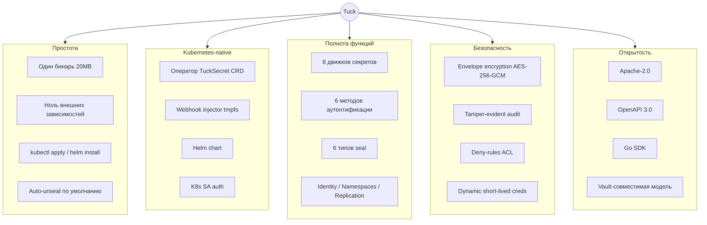
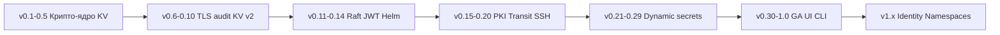

# 01 — Обзор продукта

[← К оглавлению](README.md)

---

## 1.1. Что такое Tuck

**Tuck** — менеджер секретов (secrets manager) и платформа управления чувствительными данными для современной инфраструктуры, в первую очередь Kubernetes. Он отвечает за:

- **хранение секретов** (пароли, API-ключи, токены, сертификаты) в зашифрованном виде;
- **выдачу динамических, короткоживущих учётных данных** для облаков и баз данных;
- **аутентификацию** приложений и людей;
- **авторизацию** через политики (ACL);
- **криптографию как сервис** (шифрование, подпись, выпуск сертификатов);
- **аудит** всех обращений к секретам.

Девиз проекта: *«The simplest Kubernetes-native secrets manager. Tuck a secret away — no ceremony.»* («Спрячь секрет — без лишних ритуалов».)

---

## 1.2. Проблема, которую решает Tuck

Управление секретами — обязательная часть зрелой инфраструктуры. Отраслевой стандарт, HashiCorp Vault, решает задачу, но дорог в эксплуатации:

| Болевая точка Vault | Последствие |
|---------------------|-------------|
| Требует кластера хранения (Consul или Integrated Storage / Raft) | Отдельная инфраструктура, DBA-навыки |
| Ручное распечатывание (unseal) после каждого рестарта | Дежурные операторы, риск простоя |
| Сложная модель ACL и операций | Высокий порог входа, ~2–4 ч на первичную настройку |
| Часть фич (Namespaces, MFA, DR, HSM) только в платном Enterprise | Дорогой total cost of ownership |
| Бинарь ~300 МБ | Тяжёлые образы, медленный старт |

**Tuck снимает именно операционную сложность**, сохраняя при этом богатый функционал:

- Один статический бинарь ~20 МБ, **ноль внешних зависимостей в runtime** (хранилище — встроенный bbolt).
- **Auto-unseal по умолчанию** (dev / Transit / AWS KMS / GCP KMS / Azure Key Vault) — рестарт не требует ручных действий.
- **Встроенный Kubernetes-оператор** и webhook-инжектор — не нужно ставить отдельный External Secrets Operator.
- **`kubectl apply` / `helm install`** — рабочий инстанс за минуты, а не часы.
- Все «энтерпрайз»-фичи (Namespaces, Identity, репликация) — в open-source ядре.

> **Главный тезис позиционирования:** «Тот же ментальный аппарат, что у Vault (токены, политики, движки, seal), но операционная модель проще на порядок».

---

## 1.3. Целевая аудитория

| Роль | Сценарий использования | Что ценит |
|------|------------------------|-----------|
| **Platform Engineer** | Централизованные секреты для кластера/команды | k8s-native, единый бинарь, оператор |
| **DevOps / SRE** | Замена Vault без операционного оверхеда | auto-unseal, HA из коробки, простой Day-2 |
| **Startup CTO / Tech Lead** | Быстрый старт без выделенной инфраструктуры | время до первого секрета < 10 мин |
| **Security Engineer** | Аудит, ACL, динамические креды, ротация | hash-chain audit, deny-rules, dynamic secrets |
| **Backend-разработчик** | Получить секрет/сертификат из приложения | SDK, CLI, агент-инжектор, понятный API |

---

## 1.4. Ключевые дифференциаторы

---

## 1.5. Обзор возможностей

### Ядро и хранилище
- **Envelope-шифрование** AES-256-GCM: `root key → DEK → шифртекст`. Ротация ключа перезаворачивает только DEK, данные не перешифровываются.
- **Хранилище**: встроенный bbolt (один файл) **или** встроенный Raft (HA-кластер 3–5 нод, pure-Go, без внешних процессов).
- **Plaintext никогда не попадает на диск** — физическое хранилище видит только шифртекст.

### Seal / Unseal (6 типов)
`dev` (локальный auto-unseal), `shamir` (кворум n-of-k), `transit` (Vault-совместимый API), `awskms`, `gcpkms`, `azurekv` (облачный auto-unseal через KMS/Key Vault и cloud-native identity).

### Движки секретов
- **KV v1** — простое key-value хранилище.
- **KV v2** — версии, CAS (check-and-set), soft-delete/undelete/destroy, `max_versions`.
- **Cubbyhole** — приватное хранилище токена, авто-очистка при отзыве.
- **Response Wrapping** — одноразовые токены `tuck_wrap_` для безопасной передачи секретов.
- **Database** — динамические креды PostgreSQL/MySQL, авто-отзыв по lease.
- **AWS / GCP / Azure** — динамические облачные креды (IAM user / STS, SA-ключи / OAuth2, AD client secrets).
- **PKI** — внутренний X.509 CA, выпуск сертификатов по ролям, CRL.
- **Transit** — шифрование-как-сервис (AES-GCM, ECDSA, Ed25519, RSA), sign/verify/HMAC, rewrap.
- **SSH** — CA-режим, подпись пользовательских/хостовых сертификатов.
- **TOTP** — RFC 6238, генерация и валидация OTP-кодов, `otpauth://` URL.

### Методы аутентификации
`Token`, `Kubernetes SA` (TokenReview), `JWT/OIDC` (JWKS), `AppRole` (role_id+secret_id), `LDAP/AD`, `GitHub Actions OIDC`.

### Identity и мультиарендность
- **Entity & Identity** — сущности, алиасы, группы, group-алиасы (объединение нескольких auth-личностей в одну identity).
- **Namespaces** — изоляция политик/секретов по неймспейсам (мультиарендность).
- **Replication** — WAL и режимы primary/secondary.
- **Mount table** и **Plugin catalog** — управление точками монтирования движков и каталогом плагинов.

### Авторизация
ACL-политики с glob-сопоставлением путей и **deny-правилами** (deny имеет приоритет над allow). Capabilities: `read`, `write`, `delete`, `list`, `deny`.

### Kubernetes-интеграция
- **TuckSecret CRD + оператор** — синхронизация секретов в нативные K8s Secret; leader election (Lease); status conditions; `deletionPolicy` (Retain/Delete).
- **Webhook Agent Injector** — init-контейнер пишет секреты на tmpfs-volume, минуя etcd.
- **Helm chart** — server + operator + опциональный injector.

### Наблюдаемость и операции
Prometheus-метрики (`/metrics`), OpenTelemetry-трейсинг (OTLP), tamper-evident audit-лог (SHA-256 hash chain, значения секретов не логируются), audit sinks (webhook/syslog), TLS (self-signed ECDSA или свой сертификат), graceful shutdown (drain + seal), per-IP rate limiting, backup/restore (bbolt snapshot), ротация ключей, фоновый GC токенов/leases каждые 15 минут.

### Интерфейсы
- **Встроенный веб-дашборд** `/ui/` — покрытие ~85% API.
- **CLI** `tuckcli` — полный охват операций.
- **Go SDK** `pkg/client` — типизированный клиент (70+ методов).
- **OpenAPI 3.0** spec `/openapi.json`.

---

## 1.6. Состав бинарей (компоненты поставки)

| Бинарь | Назначение |
|--------|------------|
| `tuck` | HTTP-сервер (ядро) — точка входа |
| `tuckcli` | CLI-клиент |
| `tuck-operator` | Kubernetes-оператор (TuckSecret CRD) |
| `tuck-injector` | MutatingWebhook-сервер |
| `tuck-agent` | init-контейнер: получает секреты, пишет на tmpfs |
| `tuckcsi` | CSI-драйвер (в работе, v1.5.0) |

---

## 1.7. Глоссарий

| Термин | Определение |
|--------|-------------|
| **Barrier** | Криптографический барьер: слой AES-256-GCM, через который проходят все данные перед записью в физическое хранилище |
| **Seal / Unseal** | «Запечатывание»/«распечатывание». В sealed-состоянии root key недоступен, сервер не обслуживает запросы |
| **Root key** | Корневой 32-байтовый ключ, существует только в памяти, предоставляется механизмом seal |
| **DEK** | Data Encryption Key — ключ шифрования данных, хранится зашифрованным root key (envelope encryption) |
| **Shamir's Secret Sharing** | Схема разделения секрета на N долей, восстановление требует K долей |
| **Lease** | Аренда: запись о выданных динамических кредах с TTL и авто-отзывом |
| **Accessor** | Непрозрачный псевдоним токена (`tuck_acc_`) для lookup/revoke без знания самого токена |
| **Policy / ACL** | Политика доступа: набор правил «путь → capabilities» |
| **Capability** | Право: read / write / delete / list / deny |
| **Engine (движок)** | Подсистема, реализующая определённый класс секретов (KV, PKI, Transit, ...) |
| **Mount** | Точка монтирования движка по пути |
| **Entity / Identity** | Сущность — единая identity, объединяющая несколько auth-алиасов |
| **Namespace** | Логически изолированное пространство секретов/политик (мультиарендность) |
| **Response Wrapping** | Упаковка ответа в одноразовый токен для безопасной передачи |
| **Cubbyhole** | Приватное хранилище конкретного токена |

---

## 1.8. История развития (вехи)

Проект прошёл 32 основных майлстоуна (M0–M32) до GA-релиза **v1.0.0** (2026-06-12) и продолжается в ветке v1.x (Identity, Namespaces, audit streaming, mlock и др.). Детальная история — в [`docs/ROADMAP.md`](../docs/ROADMAP.md) и [`CHANGELOG.md`](../CHANGELOG.md).

---

[← К оглавлению](README.md) · [Далее: Архитектура →](02-architecture.md)
