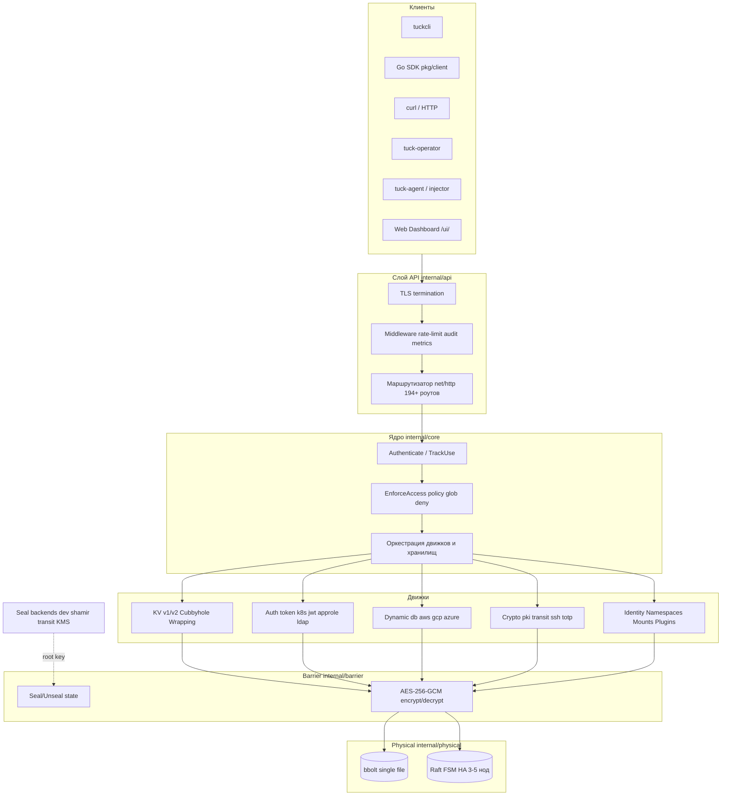
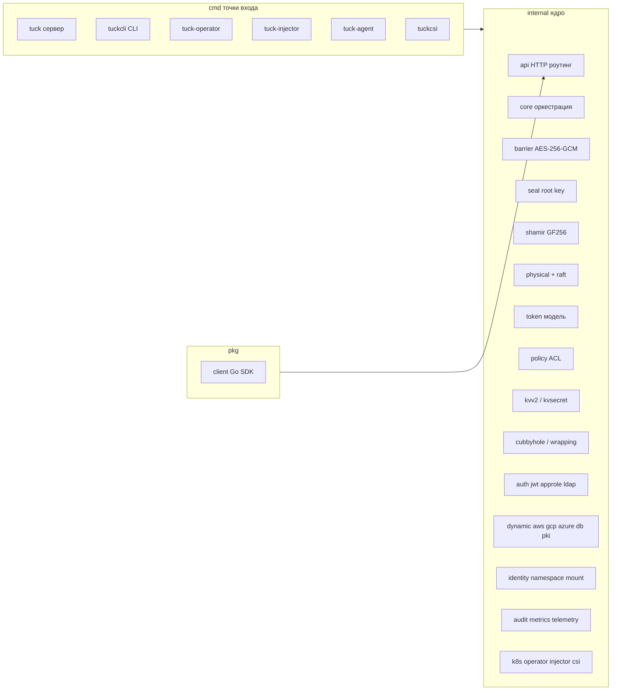
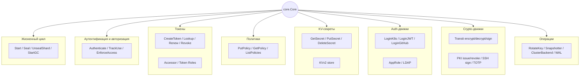
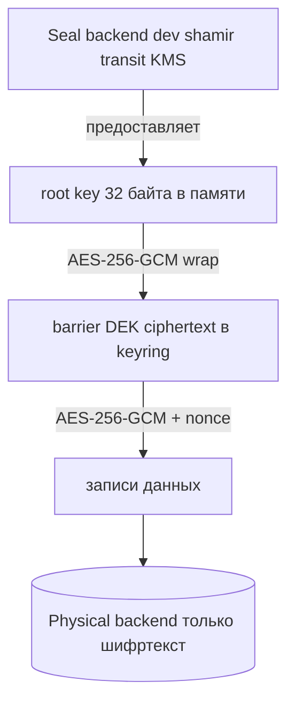
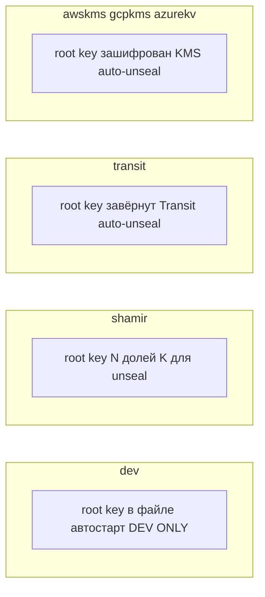
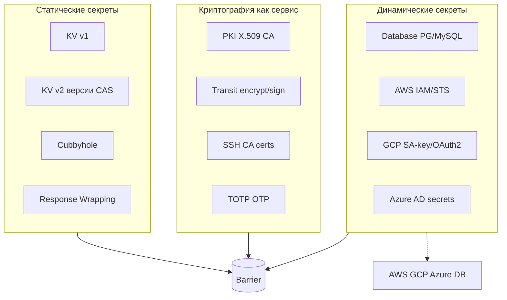
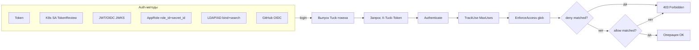
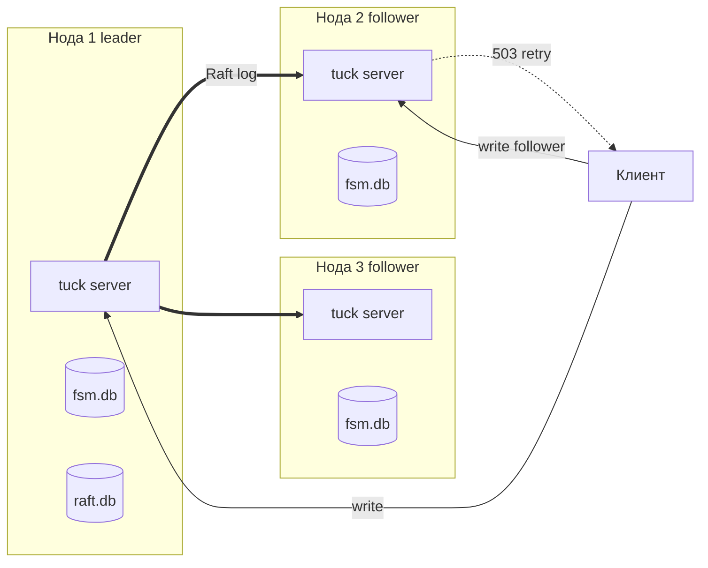
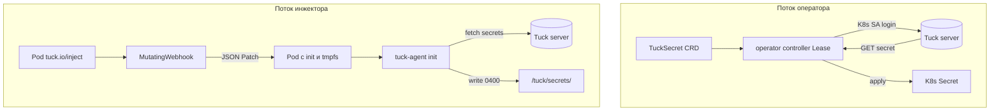

# 02 — Архитектура и карта функций

[← Назад: Обзор](01-overview.md) · [К оглавлению](README.md) · [Далее: Sequence-диаграммы →](03-sequence-diagrams.md)

---

## 2.1. Архитектурные принципы

Эти принципы зафиксированы в проекте как «не нарушать»:

1. **Один бинарь** — никаких внешних runtime-зависимостей (хранилище встроенное).
2. **Всё через барьер** — plaintext никогда не касается физического хранилища.
3. **Узкий `barrierIface`** — каждый движок видит только `Get/Put/Delete/List`, никогда — полный `physical.Backend`.
4. **Единый паттерн dynamic-движков** — `config CRUD + role CRUD + creds + lease CRUD`.
5. **Фоновый GC каждые 15 минут** — истёкшие токены / leases / wrapping-токены.
6. **Deny-правила побеждают** — deny в любой политике блокирует, независимо от allow.
7. **Ключевой материал зануляется** после использования.
8. **Audit перед операцией** — fail-closed: нет audit → нет операции.

---

## 2.2. Слоистая архитектура (C4 — уровень контейнеров/слоёв)

---

## 2.3. Карта пакетов (структура кода)

### Назначение ключевых пакетов

| Пакет | Ответственность |
|-------|-----------------|
| `internal/api` | HTTP-слой: 194+ роутов, middleware (audit, rate-limit, metrics), сериализация |
| `internal/core` | Оркестрация: аутентификация, проверка доступа, маршрутизация в движки |
| `internal/barrier` | Криптобарьер AES-256-GCM, состояние sealed/unsealed |
| `internal/seal` | Жизненный цикл root key: dev / shamir / transit / awskms / gcpkms / azurekv |
| `internal/shamir` | Shamir's Secret Sharing над GF(256): Split / Combine |
| `internal/physical` | Физический слой: bbolt (single file), in-memory (тесты) |
| `internal/physical/raft` | Raft-реплицируемый backend (HA 3–5 нод) |
| `internal/token` | Модель токенов: генерация, TTL, accessor, roles, MaxUses |
| `internal/policy` | ACL: glob-сопоставление путей, capability-проверки, deny-first |
| `internal/kvv2`, `kvsecret` | KV v2 (версии/CAS/soft-delete) и KV v1 |
| `internal/cubbyhole`, `wrapping` | Приватное хранилище токена; одноразовые wrapping-токены |
| `internal/auth/*` | JWT/OIDC, AppRole, LDAP/AD, GitHub OIDC |
| `internal/dynamic/*` | 8 движков: aws, gcp, azure, database, pki, transit, ssh, totp |
| `internal/identity` | Entities, aliases, groups, group-aliases |
| `internal/namespace` | Изоляция по неймспейсам (мультиарендность) |
| `internal/mount`, `plugin` | Mount table; каталог плагинов |
| `internal/replication` | WAL и режимы primary/secondary |
| `internal/audit` | Tamper-evident лог (SHA-256 hash chain), audit sinks |
| `internal/metrics`, `telemetry` | Prometheus; OpenTelemetry (OTLP) |
| `internal/ratelimit` | Per-IP и per-token token-bucket |
| `internal/k8s`, `operator`, `injector`, `csi` | K8s TokenReview; CRD-контроллер; webhook; CSI |
| `internal/tlsutil`, `ui`, `config`, `sysconfig` | TLS-хелперы; embedded дашборд; конфиг-файл; runtime-конфиг |
| `pkg/client` | Типизированный Go SDK |

---

## 2.4. Карта функций ядра (`core.Core`)

`core.Core` — центральный фасад. Ниже сгруппированы публичные методы (карта функций).

---

## 2.5. Криптографическая модель (envelope encryption)

**Суть:** root key шифрует DEK; DEK шифрует записи. При ротации меняется только обёртка DEK — данные не перешифровываются. На рестарте: `seal.Unseal()` → root key → `barrier.Unseal()` → DEK расшифрован → сервер готов.

---

## 2.6. Типы seal (распечатывание)

| Тип | Кейс | Распечатывание | Креды |
|-----|------|----------------|-------|
| `dev` | Локальная разработка | Авто (plaintext-файл) | — |
| `shamir` | On-prem, multi-operator | Ручное, K-of-N долей | — |
| `transit` | Облако, есть внешний Vault/Transit | Авто | токен Transit (через env) |
| `awskms` | EKS / EC2 | Авто | IRSA / instance role |
| `gcpkms` | GKE | Авто | Workload Identity / ADC |
| `azurekv` | AKS / Azure | Авто | Managed Identity / DefaultAzureCredential |

---

## 2.7. Раскладка логических ключей в хранилище

Все значения зашифрованы барьером. Примеры логических путей:

| Логический ключ | Содержимое |
|-----------------|------------|
| `barrier/keyring` | DEK, зашифрованный root key |
| `auth/token/<hash>` | JSON-запись токена (включает accessor) |
| `auth/accessor/<accessor>` | Индекс accessor → token ID |
| `auth/policy/<name>` | JSON политики |
| `auth/<method>/...` | Конфиги/роли auth-движков (k8s, jwt, approle, ldap, github) |
| `secret/<path>` | KV v1 значение |
| `kvv2/<path>/meta`, `kvv2/<path>/v/<n>` | KV v2 метаданные и версии |
| `dynamic/<engine>/config` | Конфиг dynamic-движка (секреты внутри зашифрованы) |
| `dynamic/<engine>/roles/<name>` | Роль движка |
| `dynamic/<engine>/leases/<id>` | Lease выданных кредов |
| `dynamic/pki/ca`, `.../certs/<serial>` | CA + записи сертификатов (без приватных ключей leaf) |
| `dynamic/transit/keys/<name>` | Все версии Transit-ключа |
| `dynamic/ssh/ca`, `dynamic/totp/keys/<name>` | SSH CA; TOTP-секреты |
| `sys/wrapping/<id>` | Запись wrapping-токена |
| `cubbyhole/<token_id>/<path>` | Приватное хранилище токена |
| `audit/last_hash` | Последний хеш цепочки аудита |

---

## 2.8. Карта движков секретов

**Единый паттерн dynamic-движков (11 эндпоинтов):** `config` (PUT/GET/DELETE/LIST) + `roles` (PUT/GET/DELETE/LIST) + `creds` (POST) + `lease` (GET/DELETE/LIST). Это делает API предсказуемым и упрощает обучение.

---

## 2.9. Карта аутентификации и авторизации

**Модель ACL:** двухпроходная — сначала deny-проход (любой совпавший deny → отказ), затем allow-проход. Capabilities: `read`, `write`, `delete`, `list`, `deny`. Glob: `secret/db/*` совпадает с `secret/db/password`, но не с `secret/db/sub/key`; `secret/**` — рекурсивно. Root-политика совпадает со всем.

---

## 2.10. HA: Raft-кластер

- Все записи идут через Raft-лог (leader → кворум большинства → commit).
- Реплицируется **только шифртекст** AES-256-GCM.
- FSM на bbolt применяет committed-команды `put`/`delete`.
- Запись на follower → `503 not leader`, клиент повторяет к лидеру.
- Онлайн-изменение состава: `AddVoter` / `RemoveServer` через HTTP API лидера.

---

## 2.11. Kubernetes-интеграция

**Оператор**: синхронизирует секреты из Tuck в нативные K8s Secret; кэширует Tuck-токен (TTL ~4 мин, обновление за 30с); только лидер реконсайлит; status conditions (`Synced`, `Ready`); финализатор при `deletionPolicy: Delete`.

**Инжектор**: webhook добавляет в Pod `emptyDir{medium: Memory}` (tmpfs) + init-контейнер `tuck-agent`, который атомарно пишет секреты (mode `0400`) до старта app-контейнеров. Секреты живут только в памяти Pod — **etcd не затрагивается**.

---

## 2.12. Наблюдаемость

| Канал | Эндпоинт / механизм | Содержимое |
|-------|---------------------|------------|
| Метрики | `GET /metrics` | счётчики/гистограммы по route+status, `tuck_sealed`, auth success/fail, uptime |
| Трейсинг | OTLP exporter | спаны HTTP-запросов (опционально) |
| Аудит | hash-chain лог + sinks (file/stdout/webhook/syslog) | кто (accessor), что (path+capability), когда, результат; **значения секретов не логируются** |
| Логи | structured slog (JSON), request-id | без секретов |
| Health | `/v1/health`, `/v1/sys/ready`, `/v1/sys/seal-status` | liveness/readiness/seal-состояние |

**Аудит — tamper-evident:** `hash_n = SHA256(hash_{n-1} || entry_json)`. Разрыв цепочки детектируется. Запись в аудит — перед операцией (fail-closed).

---

[← Назад: Обзор](01-overview.md) · [К оглавлению](README.md) · [Далее: Sequence-диаграммы →](03-sequence-diagrams.md)
