# 03 — Sequence-диаграммы ключевых сценариев

[← Назад: Архитектура](02-architecture.md) · [К оглавлению](README.md) · [Далее: API/CLI →](04-api-cli-reference.md)

Здесь — последовательности взаимодействия для наиболее важных потоков Tuck.

---

## 3.1. Запуск и распечатывание (Shamir)

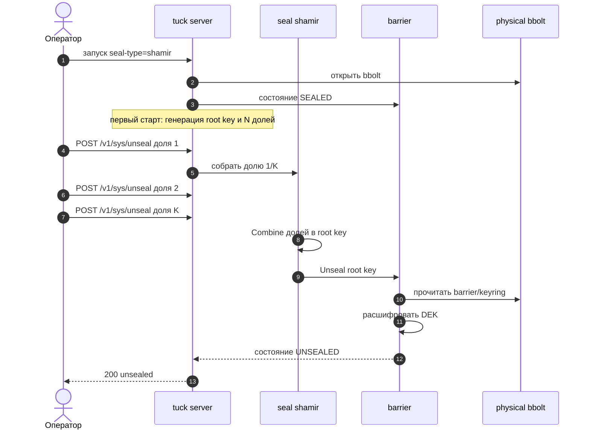

---

## 3.2. Авто-распечатывание (AWS KMS / GCP KMS / Azure KV)

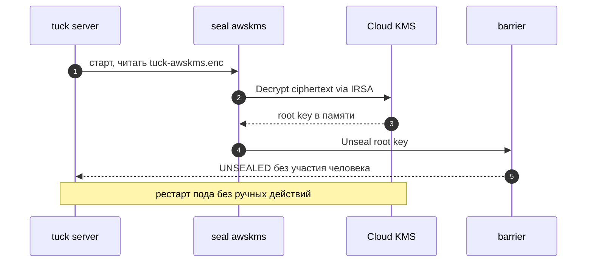

---

## 3.3. Запись и чтение KV-секрета (с проверкой ACL)

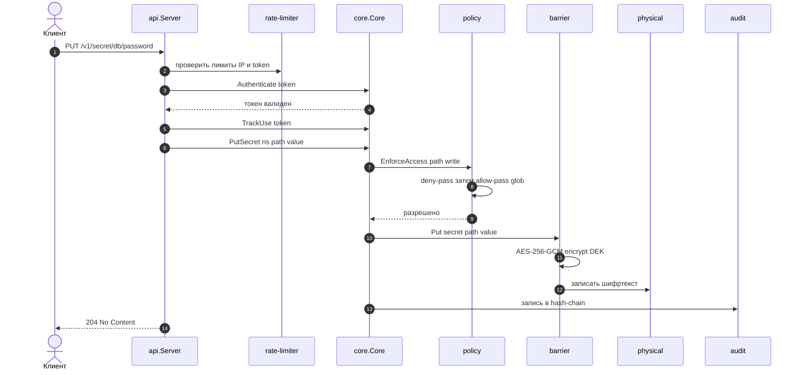

При чтении (`GET`) поток аналогичен, но capability — `read`, и барьер расшифровывает значение перед отдачей.

---

## 3.4. Аутентификация приложения через Kubernetes SA

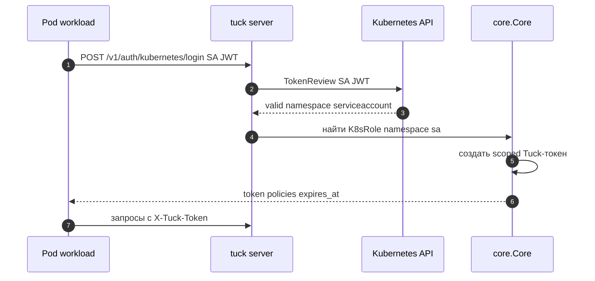

---

## 3.5. Динамические креды БД (с lease и авто-отзывом)

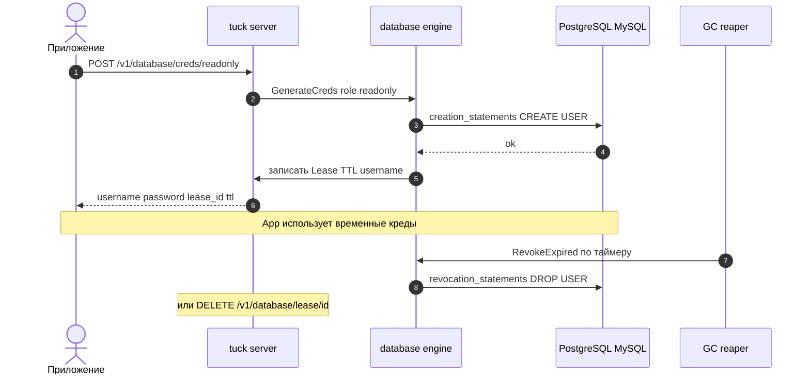

---

## 3.6. Выпуск TLS-сертификата (PKI)

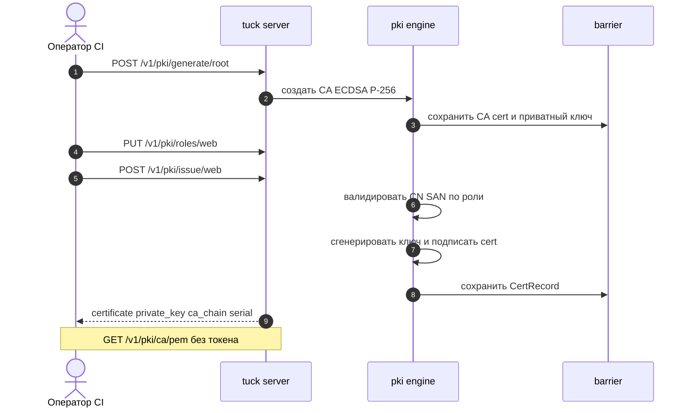

---

## 3.7. Transit — шифрование как сервис + ротация и rewrap

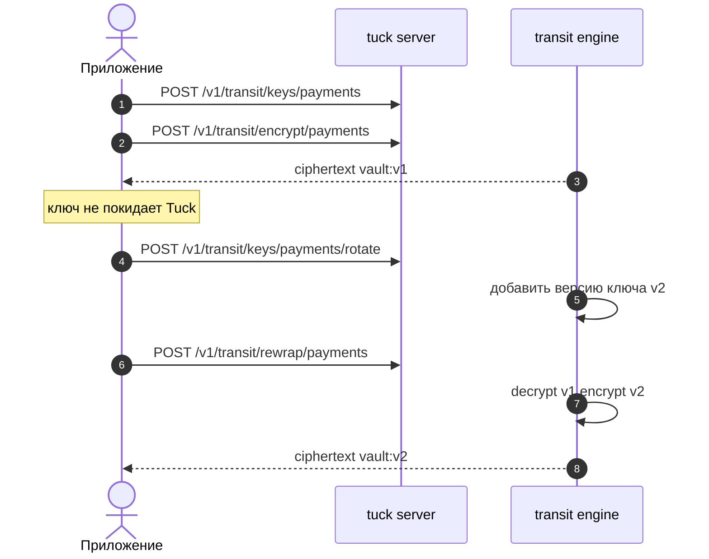

---

## 3.8. Response Wrapping — безопасная передача секрета

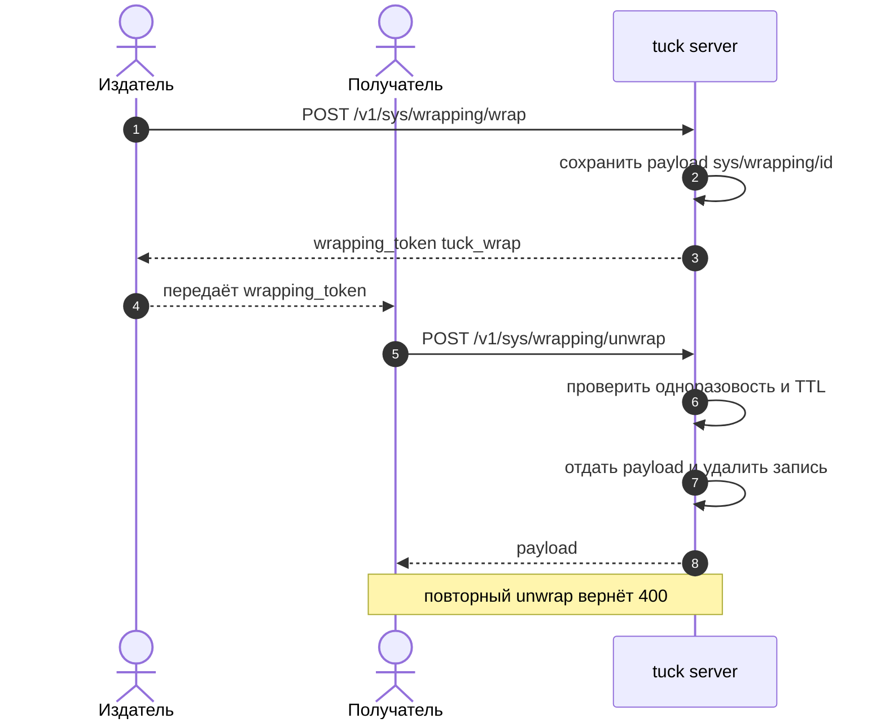

---

## 3.9. Синхронизация TuckSecret оператором в K8s Secret

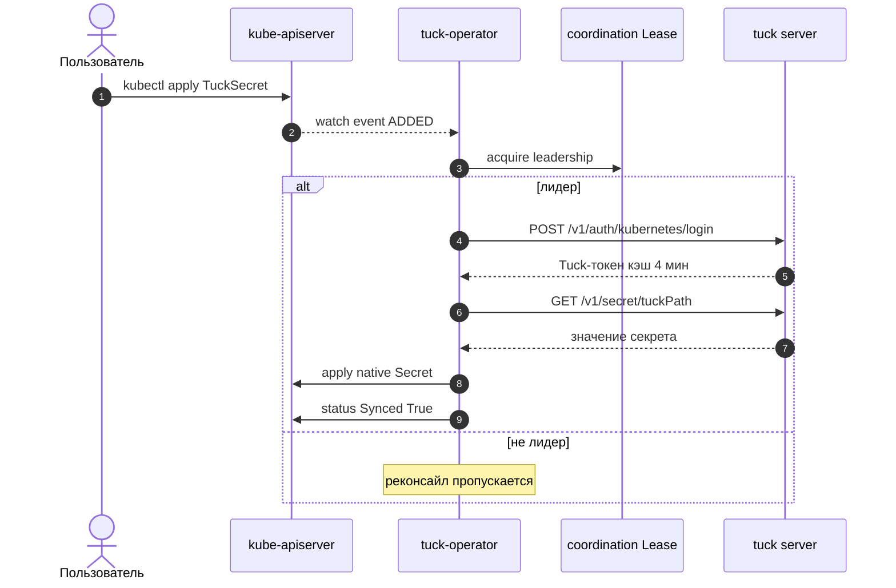

---

## 3.10. Webhook-инъекция секретов в Pod (минуя etcd)

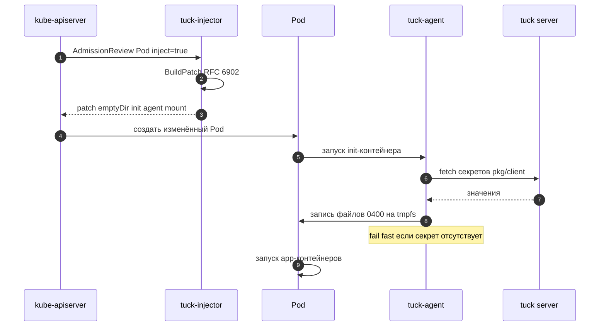

---

## 3.11. HA-запись через Raft (forwarding на лидера)

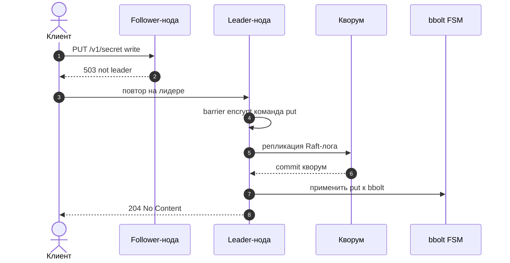

---

## 3.12. Ротация root-ключа без простоя

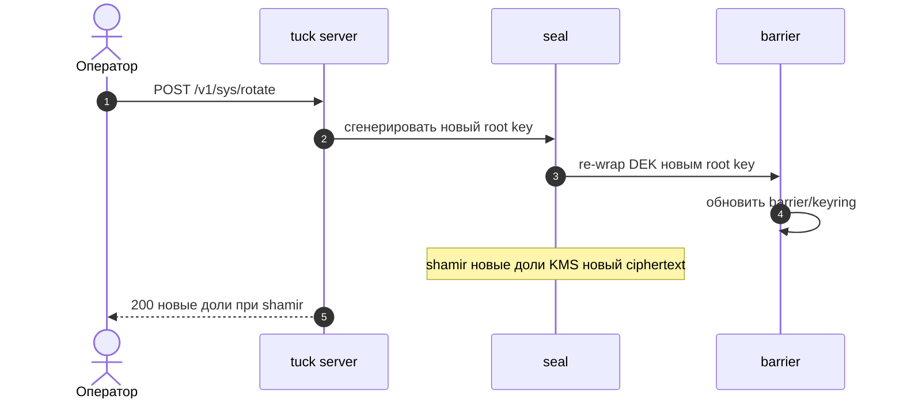

---

[← Назад: Архитектура](02-architecture.md) · [К оглавлению](README.md) · [Далее: API/CLI →](04-api-cli-reference.md)
