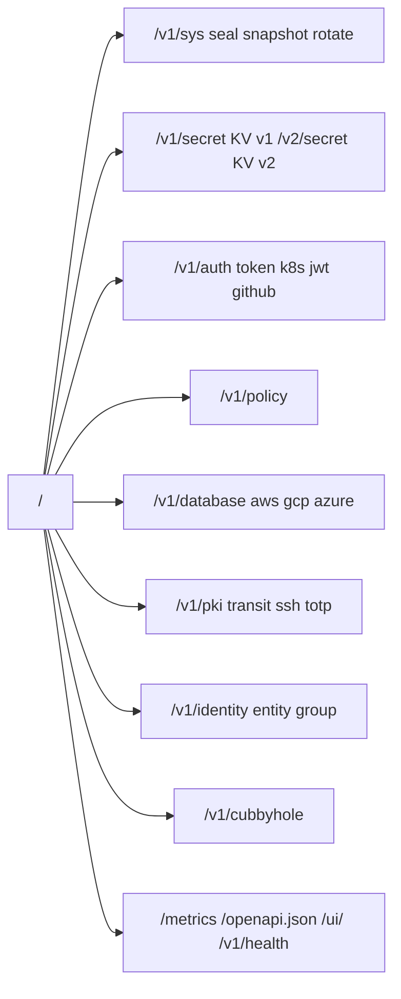

# 04 — Справочник API, CLI и SDK

[← Назад: Sequence-диаграммы](03-sequence-diagrams.md) · [К оглавлению](README.md) · [Далее: Анализ зрелости →](05-maturity-analysis.md)

> Все эндпоинты требуют заголовок `X-Tuck-Token`, кроме помеченных **public**.
> Базовый префикс — `/v1` (KV v2 — `/v2`). Опциональный заголовок `X-Tuck-Namespace` выбирает неймспейс.
> Полная машинно-читаемая спецификация доступна по `GET /openapi.json` (OpenAPI 3.0).

---

## 4.1. Обзор групп API (194+ эндпоинтов)



---

## 4.2. Система (`/v1/sys`, `/v1/health`)

| Метод | Путь | Auth | Описание |
|-------|------|------|----------|
| GET | `/v1/health` | public | Liveness, версия, uptime, ha_enabled, sealed |
| GET | `/v1/sys/seal-status` | public | Состояние seal |
| GET | `/v1/sys/ready` | public | Readiness (503 если sealed) |
| POST | `/v1/sys/unseal` | public | Отправить долю Shamir |
| POST | `/v1/sys/seal` | token | Запечатать сервер |
| POST | `/v1/sys/rotate` | token | Ротация root key |
| GET | `/v1/sys/snapshot` | token | Скачать bbolt-бэкап |
| GET/PUT | `/v1/sys/config` | token | Runtime-конфиг (rate-limit и т.п.) |
| POST | `/v1/sys/leases/renew` | token | Продлить lease |
| GET/DELETE | `/v1/sys/leases/{id...}` | token | Просмотр / отзыв lease |
| LIST | `/v1/sys/leases/` | token | Список leases |
| GET | `/v1/sys/mounts` | token | Таблица монтирования |
| POST/DELETE | `/v1/sys/mounts/{path...}` | token | Создать / удалить mount |
| GET/POST | `/v1/sys/mounts-tune/{path...}` | token | Тюнинг mount |
| LIST/GET/POST/DELETE | `/v1/sys/plugins/catalog/{type}/{name}` | token | Каталог плагинов |
| POST/PUT/DELETE/LIST | `/v1/sys/namespaces[/{name}]` | token | Управление неймспейсами |
| PUT/DELETE/LIST | `/v1/sys/audit/...` | token | Audit sinks (webhook) |
| GET/POST | `/v1/sys/replication/*` | token | Статус/режимы primary/secondary, WAL |
| GET | `/v1/sys/cluster` | token | Статус Raft-кластера |
| POST | `/v1/sys/cluster/join` | token | Добавить Raft-voter |
| DELETE | `/v1/sys/cluster/node/{id}` | token | Удалить Raft-voter |
| POST | `/v1/sys/wrapping/wrap` | token | Завернуть payload |
| POST | `/v1/sys/wrapping/unwrap` | token | Развернуть (одноразово) |
| POST | `/v1/sys/wrapping/lookup` | token | Метаданные wrapping-токена |
| DELETE | `/v1/sys/wrapping/revoke` | token | Отозвать wrapping-токен |

---

## 4.3. KV v1 и KV v2

**KV v1** (`/v1/secret/{path...}`): GET / PUT / DELETE / LIST.

**KV v2** (`/v2/secret/...`) — версионирование:

| Метод | Путь | Описание |
|-------|------|----------|
| GET/PUT/DELETE | `/v2/secret/{path...}` | Чтение / запись (новая версия) / soft-delete |
| LIST | `/v2/secret/{path...}` | Список ключей |
| POST | `/v2/secret/undelete/{path...}` | Восстановить soft-deleted версию |
| POST | `/v2/secret/destroy/{path...}` | Перманентное удаление |
| GET/PUT/DELETE/LIST | `/v2/secret/metadata/{path...}` | Метаданные версий, `max_versions`, CAS |

**Cubbyhole** (`/v1/cubbyhole/{path...}`): GET / PUT / DELETE / LIST — приватное хранилище токена.

---

## 4.4. Аутентификация

### Token (`/v1/auth/token`)
| Метод | Путь | Описание |
|-------|------|----------|
| POST | `/v1/auth/token` | Создать токен (policies, TTL, MaxTTL, renewable, num_uses) |
| GET/DELETE | `/v1/auth/token/{id}` | Lookup / revoke |
| POST | `/v1/auth/token/{id}/renew` | Продлить |
| LIST | `/v1/auth/token/` | Список |
| GET | `/v1/auth/token/lookup-self` | Информация о текущем токене |
| POST | `/v1/auth/token/renew-self` | Продлить свой токен |
| POST | `/v1/auth/token/lookup-accessor` | Lookup по accessor |
| DELETE | `/v1/auth/token/revoke-accessor` | Revoke по accessor |
| PUT/GET/DELETE/LIST | `/v1/auth/token/roles/{name}` | Token roles |
| POST | `/v1/auth/token/roles/{role}/create` | Создать токен из роли |

### Внешние методы (login — public)
| Метод | Путь | Описание |
|-------|------|----------|
| POST | `/v1/auth/kubernetes/login` | K8s SA (TokenReview) |
| PUT/GET/DELETE | `/v1/auth/kubernetes/role/{ns}/{sa}` | K8s role binding |
| POST | `/v1/auth/jwt/login` | JWT/OIDC |
| GET/PUT | `/v1/auth/jwt/config` | JWKS-конфиг |
| PUT/GET/DELETE/LIST | `/v1/auth/jwt/role/{name}` | JWT-роли |
| POST | `/v1/auth/github/login` | GitHub Actions OIDC |
| PUT/GET/DELETE/LIST | `/v1/auth/github/role/{name}` | GitHub-роли |
| POST | `/v1/auth/approle/login` | AppRole |
| PUT/GET/DELETE/LIST | `/v1/auth/approle/role/{name}` | AppRole-роли |
| POST/GET/DELETE | `/v1/auth/approle/role/{name}/secret-id[/{id}]` | secret-id |
| POST | `/v1/auth/ldap/login` | LDAP/AD |
| GET/PUT | `/v1/auth/ldap/config` | LDAP-конфиг (bind_password скрыт на GET) |
| PUT/GET/DELETE/LIST | `/v1/auth/ldap/role/{name}` | LDAP-роли |

---

## 4.5. Политики (`/v1/policy`)
| Метод | Путь | Описание |
|-------|------|----------|
| PUT/GET/DELETE | `/v1/policy/{name}` | Управление политикой |
| LIST | `/v1/policy/` | Список |

Пример политики:

```json
{
  "name": "db-readwrite",
  "rules": [
    {"path": "secret/db/*",     "capabilities": ["read", "write", "delete"]},
    {"path": "secret/shared/*", "capabilities": ["read"]},
    {"path": "secret/db/admin",  "capabilities": ["deny"]}
  ]
}
```

---

## 4.6. Динамические секреты (единый 11-эндпоинтный паттерн)

Движки `database`, `aws`, `gcp`, `azure` имеют одинаковую форму API:

```
PUT/GET/DELETE  /v1/<engine>/config[/{name}]   — конфиг подключения
LIST            /v1/<engine>/config/            — список конфигов (database)
PUT/GET/DELETE  /v1/<engine>/roles/{name}       — роль
LIST            /v1/<engine>/roles/             — список ролей
POST            /v1/<engine>/creds/{role}       — выдать креды (+ lease)
GET/DELETE      /v1/<engine>/lease/{id}         — просмотр / отзыв lease
LIST            /v1/<engine>/lease/             — список leases
```

| Движок | Что выдаёт |
|--------|------------|
| `database` | Временные креды PostgreSQL/MySQL |
| `aws` | IAM user creds или STS AssumeRole-сессия |
| `gcp` | SA JSON-ключ или OAuth2 access-токен |
| `azure` | Azure AD client secret (Graph API) |

---

## 4.7. Криптографические движки

### PKI (`/v1/pki`)
| Метод | Путь | Auth | Описание |
|-------|------|------|----------|
| POST | `/v1/pki/generate/root` | token | Сгенерировать root CA |
| POST | `/v1/pki/import/ca` | token | Импортировать CA |
| GET | `/v1/pki/ca/pem` | **public** | CA-сертификат |
| GET | `/v1/pki/crl/pem` | **public** | Текущий CRL |
| PUT/GET/DELETE/LIST | `/v1/pki/roles/{name}` | token | Роли |
| POST | `/v1/pki/issue/{role}` | token | Выпустить сертификат |
| POST | `/v1/pki/revoke/{serial}` | token | Отозвать |
| GET/LIST | `/v1/pki/certs/{serial}` | token | Записи сертификатов |

### Transit (`/v1/transit`)
| Метод | Путь | Описание |
|-------|------|----------|
| POST/GET/DELETE/LIST | `/v1/transit/keys/{name}` | Управление ключами |
| POST | `/v1/transit/keys/{name}/rotate` | Ротация (новая версия) |
| POST | `/v1/transit/keys/{name}/config` | `min_decryption_version`, `deletable` |
| POST | `/v1/transit/encrypt/{name}` · `decrypt` · `rewrap` | Шифрование / дешифрование / rewrap |
| POST | `/v1/transit/sign/{name}` · `verify` · `hmac` | Подпись / проверка / HMAC |

Типы ключей: `aes256-gcm96`, `ecdsa-p256`, `ed25519`, `rsa-2048`, `rsa-4096`. Формат: `vault:v{N}:{base64url}`.

### SSH (`/v1/ssh`)
| Метод | Путь | Auth | Описание |
|-------|------|------|----------|
| POST | `/v1/ssh/generate/ca` · `import/ca` | token | CA-ключи |
| GET | `/v1/ssh/ca/public-key` | **public** | CA pubkey для `TrustedUserCAKeys` |
| PUT/GET/DELETE/LIST | `/v1/ssh/roles/{name}` | token | Роли |
| POST | `/v1/ssh/sign/{role}` | token | Подписать pubkey → SSH-сертификат |

### TOTP (`/v1/totp`)
| Метод | Путь | Описание |
|-------|------|----------|
| POST/GET/DELETE/LIST | `/v1/totp/keys/{name}` | Управление ключами (POST возвращает `otpauth://`) |
| GET | `/v1/totp/code/{name}` | Текущий код |
| POST | `/v1/totp/code/{name}` | Валидировать код → `{"valid":true}` |

---

## 4.8. Identity (`/v1/identity`)

| Группа | Эндпоинты |
|--------|-----------|
| Entities | `POST /entity`, `GET/POST/DELETE /entity/id/{id}`, `GET/POST/DELETE /entity/name/{name}`, `LIST /entity/` |
| Entity aliases | `POST /entity-alias`, `GET/POST/DELETE /entity-alias/id/{id}`, `LIST` |
| Groups | `POST /group`, `GET/POST/DELETE /group/id/{id}`, `GET/POST/DELETE /group/name/{name}`, `LIST` |
| Group aliases | `POST /group-alias`, `GET/DELETE /group-alias/id/{id}`, `LIST` |
| Lookup | `POST /lookup/entity`, `POST /lookup/group` |

Identity объединяет несколько auth-алиасов (например, один человек логинится и через LDAP, и через JWT) в единую сущность с общими групповыми политиками.

---

## 4.9. CLI (`tuckcli`)

```sh
# Системные
tuckcli status                 # seal-статус
tuckcli unseal <share>         # отправить долю Shamir
tuckcli seal                   # запечатать
tuckcli rotate                 # ротация root key

# KV
tuckcli kv get <path>
tuckcli kv put <path> <value>
tuckcli kv delete <path>
tuckcli kv list <prefix/>

# Токены и политики
tuckcli token create --name=x --policy=y --ttl=24h
tuckcli token get|renew|revoke|list ...
tuckcli token lookup-self | renew-self
tuckcli policy put|get|delete|list ...

# Динамические креды
tuckcli db    creds <role>
tuckcli aws   creds <role>
tuckcli gcp   creds <role>
tuckcli azure creds <role>

# Крипто-движки
tuckcli pki issue <role>
tuckcli pki revoke <serial>
tuckcli transit encrypt|decrypt <key>
tuckcli ssh sign <role> <pubkey>
tuckcli totp code <key>

# Логины во внешние методы
tuckcli auth approle login ...
tuckcli auth ldap login ...
tuckcli auth jwt login ...
```

Переменные окружения: `TUCK_ADDR` (по умолчанию `https://127.0.0.1:8200`), `TUCK_TOKEN`.

---

## 4.10. Go SDK (`pkg/client`)

```go
import "github.com/NAGenaev/tuck/pkg/client"

c := client.New("https://tuck:8200", client.WithToken("tuck_..."))

// KV v1
_ = c.Put(ctx, "secret/db/password", []byte("s3cr3t"))
val, _ := c.Get(ctx, "secret/db/password")

// KV v2
_ = c.V2Write(ctx, "app/config", map[string]string{"key": "val"})
```

SDK покрывает основные операции (70+ методов): KV, токены, политики, динамические креды, крипто-движки, system-операции.

---

## 4.11. Конфигурация сервера

Приоритет: **CLI-флаг > переменная окружения > конфиг-файл > встроенный default**.

Пример `tuck.yaml`:

```yaml
addr: "0.0.0.0:8200"
data: "/var/lib/tuck/tuck.db"
tls:
  cert: "/etc/tuck/tls.crt"
  key:  "/etc/tuck/tls.key"
seal:
  type: "shamir"
  shamir:
    n: 5
    k: 3
```

> Чувствительные значения (например, токен Transit-seal) передавать через env (`TUCK_TRANSIT_TOKEN`), **не** через конфиг-файл и не флагом (виден в `ps`).

---

## 4.12. Коды ответов

| Код | Значение |
|-----|----------|
| 200 / 204 | Успех (с телом / без тела) |
| 400 | Некорректный запрос (например, повторный unwrap, не renewable) |
| 401 | Нет/невалидный/просроченный токен, превышен MaxUses |
| 403 | Доступ запрещён политикой (в т.ч. deny-правило) |
| 404 | Не найдено |
| 429 | Rate limit |
| 503 | Sealed, не готов, или «not leader» (HA — повтор к лидеру) |

---

[← Назад: Sequence-диаграммы](03-sequence-diagrams.md) · [К оглавлению](README.md) · [Далее: Анализ зрелости →](05-maturity-analysis.md)
