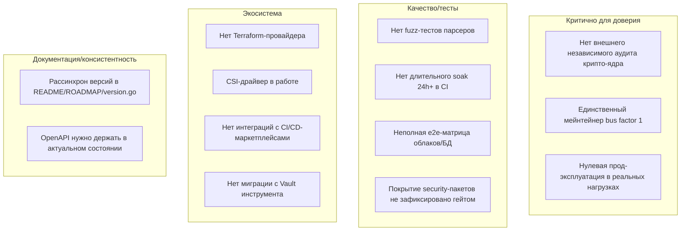
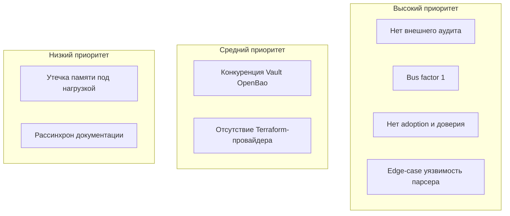

# 05 — Анализ зрелости проекта

[← Назад: API/CLI](04-api-cli-reference.md) · [К оглавлению](README.md) · [Далее: Тестирование →](06-testing.md)

> Цель раздела — честно оценить, насколько Tuck готов к промышленной эксплуатации, и что ещё нужно сделать. Менеджер секретов — корень доверия инфраструктуры, поэтому планка намеренно высокая.

---

## 5.1. Сводная оценка зрелости

Шкала 1–10 (10 = уровень зрелого коммерческого продукта). Оценки — экспертные, на основе анализа кода и документации.

| Измерение | Оценка | Комментарий |
|-----------|:------:|-------------|
| **Функциональность** | 9 / 10 | Полнота на уровне Vault OSS+: 8 движков, 6 auth, 6 seal, Identity, Namespaces |
| **Архитектура и качество кода** | 8 / 10 | Чистые слои, узкие интерфейсы, единые паттерны; net/http без фреймворков |
| **Безопасность (дизайн)** | 8 / 10 | Envelope encryption, hash-chain audit, deny-rules, memory zeroing, mlock |
| **Безопасность (внешняя валидация)** | 5 / 10 | govulncheck/gosec чисто, но независимого стороннего аудита крипто-ядра нет |
| **Надёжность / HA** | 7 / 10 | Встроенный Raft 3–5 нод; нужен длительный chaos/soak в реальных условиях |
| **Наблюдаемость** | 8 / 10 | Prometheus + OTel + audit sinks + structured logs |
| **Эксплуатация (Day-2)** | 8 / 10 | Auto-unseal, backup/restore, ротация, graceful shutdown, runbook |
| **Тестовое покрытие** | 6 / 10 | ~9k строк тестов, race-clean; не хватает fuzz, длительного soak, e2e-матрицы |
| **Релиз-инженерия** | 8 / 10 | goreleaser, cosign, SBOM, distroless, CI с lint/gosec |
| **Документация** | 8 / 10 | Богатая (этот docs2 + docs/), но местами рассинхрон версий |
| **Экосистема / комьюнити** | 2 / 10 | Один мейнтейнер, нет внешних контрибьюторов/звёзд/интеграций |
| **Зрелость для прод-доверия** | 5 / 10 | Технически готов, но «социальное доверие» к secrets-продукту нарабатывается годами |

**Интегральный вывод:** Tuck — **технически зрелый продукт уровня v1.0 GA** с функционалом, сопоставимым с Vault OSS. Главные риски — не в коде, а в **доверии и экосистеме**: отсутствие независимого аудита, единственный мейнтейнер, нулевая база пользователей.

---

## 5.2. Что уже сделано хорошо (сильные стороны)

1. **Полнота функционала.** 194+ эндпоинтов, 8 движков секретов, 6 методов аутентификации, 6 типов seal, Identity, Namespaces, репликация — этого достаточно для большинства промышленных сценариев.
2. **Чистая архитектура.** Узкий `barrierIface`, единый 11-эндпоинтный паттерн dynamic-движков, deny-first ACL, изоляция движков по пакетам.
3. **Безопасный дизайн по умолчанию.** Envelope encryption, plaintext не пишется на диск, tamper-evident аудит, fail-closed аудит, zeroing ключей, опциональный mlock.
4. **Операционная простота — реальный дифференциатор.** Один бинарь, auto-unseal, `kubectl apply`.
5. **Зрелый релиз-пайплайн.** Подписанные мультиарх-бинарники, SBOM, distroless non-root образы.
6. **Хорошая документация и runbook.**

---

## 5.3. Слабые места и пробелы

### Подробно

| # | Пробел | Влияние | Приоритет |
|---|--------|---------|-----------|
| 1 | **Нет внешнего security-аудита** крипто-ядра (barrier/seal/shamir/auth) | Блокер доверия для enterprise | P0 |
| 2 | **Bus factor = 1** — один автор | Риск для adoption в проде | P0 (организационный) |
| 3 | **Нет публичной прод-эксплуатации** / референс-кейсов | Нет «социального доказательства» | P1 |
| 4 | **Fuzz-тесты** парсеров (Shamir-доли, glob-ACL, JSON) отсутствуют | Риск edge-case уязвимостей | P1 |
| 5 | **Длительный soak/chaos** в CI не автоматизирован | Утечки памяти/дескрипторов под нагрузкой | P1 |
| 6 | **e2e-матрица** для реальных AWS/GCP/Azure/БД ограничена | Регрессии в dynamic-движках | P1 |
| 7 | **Terraform-провайдер** отсутствует | Барьер для IaC-команд | P1 |
| 8 | **CSI-драйвер** ещё не завершён (план v1.5.0) | Часть k8s-сценариев недоступна | P2 |
| 9 | **Инструмент миграции с Vault** отсутствует | Высокий switching cost | P2 |
| 10 | **Рассинхрон версий** в документации (README v0.32, ROADMAP v1.0 GA, version.go 1.8.0) | Путаница пользователей | P2 |
| 11 | **Coverage-гейт** на security-критичных пакетах не зафиксирован | Регрессии покрытия | P2 |

---

## 5.4. Дорожная карта «что ещё нужно сделать»

```mermaid
flowchart LR
    subgraph now["Сейчас (доверие)"]
        N1[Внешний аудит крипто-ядра]
        N2[Привлечь 2-3 co-maintainer]
        N3[Синхронизировать версии в доках]
    end
    subgraph q1["Ближайший квартал (качество)"]
        Q1[Fuzz-тесты парсеров]
        Q2[Soak 24h + chaos в CI]
        Q3[e2e-матрица облаков на nightly]
        Q4[Coverage-гейт 80pct на security]
    end
    subgraph q2["Следующий (экосистема)"]
        E1[Terraform-провайдер]
        E2[Завершить CSI-драйвер]
        E3[Vault to Tuck миграционный CLI]
        E4[Helm-чарт в Artifact Hub]
    end
    subgraph later["Позже (рост)"]
        L1[Управляемое облако SaaS]
        L2[Плагин-маркетплейс]
        L3[Сертификации SOC2/ISO]
    end
    now --> q1 --> q2 --> later
```

### Конкретные задачи по приоритетам

**P0 — блокеры доверия**
- [ ] Заказать/провести независимый аудит крипто-ядра и auth (с публичным отчётом).
- [ ] Расширить состав мейнтейнеров (снизить bus factor).
- [ ] Зафиксировать единую версию во всех артефактах (README, ROADMAP, `version.go`, CHANGELOG, бейджи).

**P1 — качество и доступность**
- [ ] Fuzz-тесты для Shamir-долей, glob-ACL, JSON-входов, нормализации путей.
- [ ] Автоматизировать 24h soak + chaos (убийство нод Raft) в nightly CI.
- [ ] e2e против реальных AWS/GCP/Azure/PostgreSQL/MySQL (по расписанию, с секретами CI).
- [ ] Coverage-гейт ≥ 80% на `barrier`, `seal`, `shamir`, `policy`, `token`, `auth/*`.
- [ ] Terraform-провайдер (`terraform-provider-tuck`).
- [ ] Референс-кейсы / публичные истории внедрения.

**P2 — экосистема и рост**
- [ ] Завершить CSI-драйвер (`tuckcsi`).
- [ ] Миграционный инструмент Vault → Tuck (KV, политики, auth-роли).
- [ ] Публикация Helm-чарта в Artifact Hub, операторов — в OperatorHub.
- [ ] GitHub Auth (классический), rate-limit на KV/token-эндпоинтах.
- [ ] Плагин-система для внешних движков.

---

## 5.5. Матрица рисков

| Риск | Митигация |
|------|-----------|
| Нет внешнего аудита | Заказать аудит; до него — явно маркировать «не прошёл независимый аудит» |
| Bus factor = 1 | Co-maintainers, прозрачный процесс, документированная архитектура |
| Нет adoption | Маркетинг, кейсы, простота онбординга, интеграции |
| Уязвимость парсера | Fuzz + быстрый security-процесс (SECURITY.md уже есть) |
| Конкуренция | Чёткая дифференциация на «операционной простоте» + k8s-native |

---

## 5.6. Definition of Done для «production-grade доверия»

- [x] Весь трафик по TLS, секреты не идут plaintext по сети
- [x] Токены/ключи не восстановимы из дампа хранилища (hashing + barrier)
- [x] Tamper-evident audit всех обращений
- [x] Graceful shutdown, liveness/readiness, sealed ⇒ not ready
- [x] Backup/restore, ротация ключей без простоя
- [x] Prometheus + structured logs без утечки секретов
- [x] Rate limiting / lockout на auth и unseal
- [x] CI: build, race, vet, lint, gosec, govulncheck
- [x] Подписанные мультиарх-бинарники + образы + SBOM
- [x] LICENSE, SECURITY.md, threat model, CHANGELOG, semver
- [ ] **Внешний security-review / аудит крипто-ядра** ← главный открытый пункт
- [ ] **Длительное soak/chaos-тестирование в реальных условиях**
- [ ] **Референс-внедрения и расширение состава мейнтейнеров**

---

[← Назад: API/CLI](04-api-cli-reference.md) · [К оглавлению](README.md) · [Далее: Тестирование →](06-testing.md)
