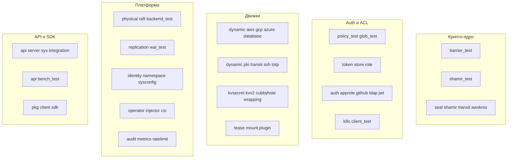
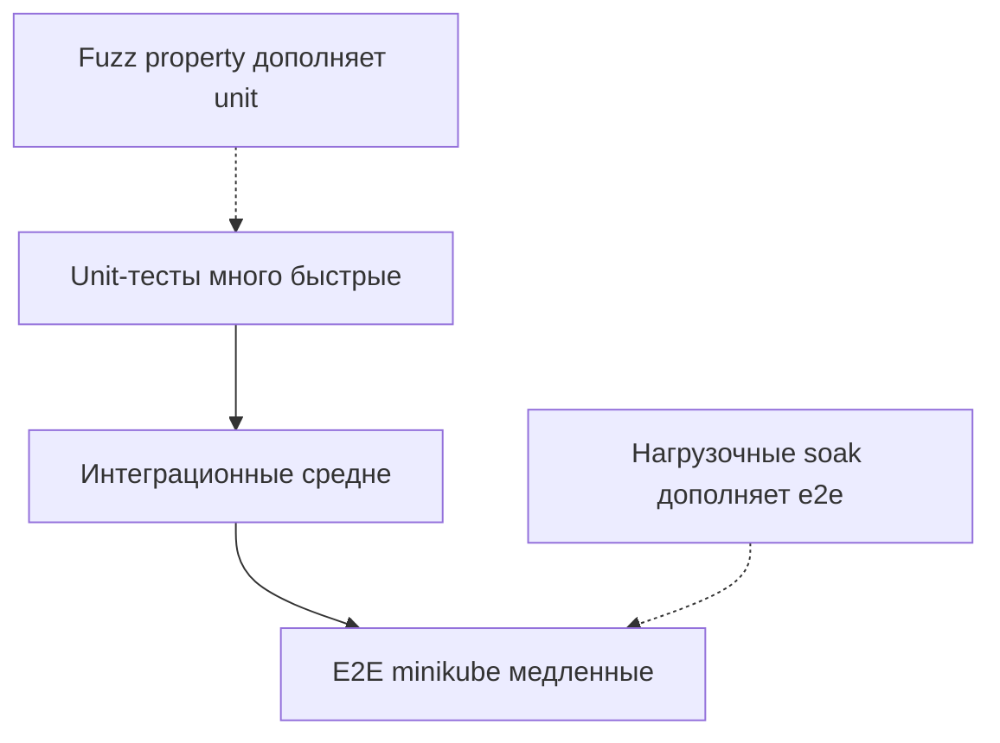
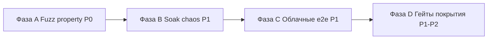

# 06 — Тестирование: состояние и план

[← Назад: Зрелость](05-maturity-analysis.md) · [К оглавлению](README.md) · [Далее: Требования →](07-requirements.md)

> Для менеджера секретов тесты — не «галочка качества», а часть периметра безопасности. Раздел инвентаризирует существующие тесты и формулирует, какие нужны.

---

## 6.1. Текущее состояние тестов

| Метрика | Значение |
|---------|----------|
| Файлов тестов | 52 |
| Строк тестов | ~9 000 |
| Соотношение тест/код | ~0.40 (9k / 22.6k) |
| Race detector | `go test -race ./...` — чисто |
| e2e на minikube | 37 / 37 PASS |
| Бенчмарки | Go benchmarks (in-process) для KV/Token/SealStatus |
| Нагрузочные | k6-сценарии smoke / load / stress / soak |

### Карта существующих тестов по пакетам

Покрытие **по площади хорошее**: тесты есть практически в каждом пакете, включая крипто-ядро, ACL, все движки, Raft, оператор, инжектор, CSI и SDK. Особо ценны:
- **RFC 6238** известные тест-векторы в `totp_test.go`.
- **Проверка цепочки x509** в `pki_test.go`.
- **Проверка SSH-сертификатов** через `gossh.CertChecker` в `ssh_test.go`.
- **Raft-консенсус** на 3-нодовом in-process кластере в `physical/raft/backend_test.go`.

---

## 6.2. Пирамида тестирования: целевая модель

Сейчас хорошо закрыты **unit** и **интеграционные** уровни. Пунктиром — то, что нужно усилить (**fuzz** и **soak/нагрузка в CI**).

---

## 6.3. Производительность (текущие бенчмарки)

In-process (AMD Ryzen 9 5950X, Go 1.25):

| Операция | Латентность (serial) | Пропускная (parallel) |
|----------|----------------------|------------------------|
| KV Get | ~20 µs | ~62k ops/s |
| KV Put | ~17 µs | ~180k ops/s |
| Token Create | ~23 µs | — |
| Token Validate | ~20 µs | ~82k ops/s |
| Seal Status | ~5.5 µs | ~182k ops/s |

k6-пороги для GA: KV GET/PUT p99 < 50 мс, token create p99 < 100 мс, error rate < 0.1%. Профиль памяти: 17–23 КБ/запрос, без явных утечек.

---

## 6.4. Пробелы в тестировании

| # | Пробел | Риск | Приоритет |
|---|--------|------|-----------|
| 1 | **Нет fuzz-тестов** парсеров (Shamir-доли, glob-ACL, JSON-входы, нормализация путей) | Edge-case паника/обход ACL | P0 |
| 2 | **Soak 24h не в CI** (есть сценарий, но не автоматизирован) | Утечки памяти/goroutine под нагрузкой | P1 |
| 3 | **Chaos-тесты Raft** (убийство лидера/ноды, network partition) ограничены | Потеря данных/split-brain | P1 |
| 4 | **e2e против реальных облаков** (AWS/GCP/Azure) и реальных БД | Регрессии dynamic-движков и seal | P1 |
| 5 | **Coverage-гейт** не зафиксирован на security-пакетах | Дрейф покрытия | P1 |
| 6 | **Тесты ротации/восстановления** (rotate → restore → consistency) не как отдельный e2e-набор | Ошибки DR | P1 |
| 7 | **Negative/abuse-тесты** rate-limit, brute-force lockout под нагрузкой | Обход защиты | P2 |
| 8 | **Тесты совместимости формата хранилища** между версиями (миграции схемы) | Поломка апгрейда | P2 |
| 9 | **Тесты на бинарную безопасность** значений (не-UTF8) во всех движках | Порча данных | P2 |
| 10 | **Property-based** для крипто-инвариантов (encrypt→decrypt идемпотентность, rewrap) | Логические дефекты | P2 |

---

## 6.5. Рекомендуемый план тестирования

### Фаза A — безопасность тестов (P0)
- [ ] `FuzzShamirParse`, `FuzzGlobMatch`, `FuzzPolicyJSON`, `FuzzPathNormalize` (нативный Go fuzzing, `go test -fuzz`).
- [ ] Property-тесты крипто: `encrypt(decrypt(x)) == x`, `rewrap` сохраняет plaintext, версия в ciphertext корректна.
- [ ] Тест «нет токена в дампе»: грепнуть `tuck.db` после создания токенов — не должно быть валидных ID.

### Фаза B — устойчивость и нагрузка (P1)
- [ ] Автоматизировать 24h soak (k6 `soak`) на nightly с мониторингом `go_goroutines` и RSS; гейт: рост RSS < 10 МБ, goroutines стабильны.
- [ ] Chaos для Raft: убийство лидера во время записи, network partition, восстановление; проверка отсутствия потери закоммиченных данных.
- [ ] e2e DR: snapshot → restore в чистый инстанс → проверка целостности всех движков.

### Фаза C — облака и интеграции (P1)
- [ ] Матрица e2e (по расписанию, секреты в CI): AWS KMS seal + AWS dynamic, GCP KMS + GCP dynamic, Azure KV + Azure dynamic, PostgreSQL + MySQL dynamic.
- [ ] e2e оператора и инжектора на `kind`/`minikube` в CI (расширить с 37 сценариев).

### Фаза D — гейты качества (P1/P2)
- [ ] Coverage-гейт ≥ 80% на `barrier`, `seal`, `shamir`, `policy`, `token`, `auth/*`, `core`.
- [ ] Мутационное тестирование (например, `go-mutesting`) на security-пакетах.
- [ ] Тесты совместимости формата хранилища между мажорными версиями.

---

## 6.6. Матрица «фича → требуемые типы тестов»

| Область | Unit | Integration | E2E | Fuzz | Soak/Chaos |
|---------|:----:|:-----------:|:---:|:----:|:----------:|
| Barrier / Seal | ✅ | ✅ | ⚠️ | ❌ нужно | — |
| Shamir | ✅ | ✅ | — | ❌ нужно | — |
| Policy / ACL | ✅ | ✅ | ✅ | ❌ нужно | — |
| Tokens | ✅ | ✅ | ✅ | — | ⚠️ |
| KV v1/v2 | ✅ | ✅ | ✅ | ⚠️ | ⚠️ |
| Dynamic (db/aws/gcp/azure) | ✅ | ⚠️ | ❌ реальные | — | — |
| PKI/Transit/SSH/TOTP | ✅ | ✅ | ⚠️ | ⚠️ | — |
| Raft HA | ✅ | ✅ | ⚠️ | — | ❌ нужно chaos |
| Operator / Injector | ✅ | ✅ | ✅(minikube) | — | — |
| Rate-limit / Audit | ✅ | ✅ | — | — | ⚠️ |

Легенда: ✅ есть · ⚠️ частично · ❌ отсутствует/нужно.

---

[← Назад: Зрелость](05-maturity-analysis.md) · [К оглавлению](README.md) · [Далее: Требования →](07-requirements.md)
