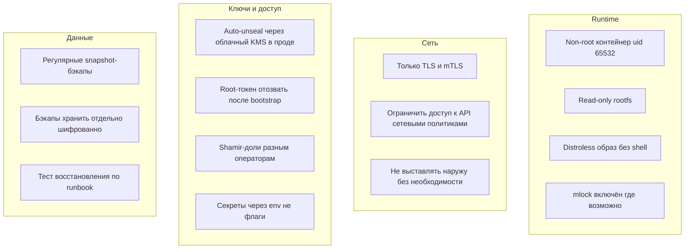

# 07 — Требования к системе

[← Назад: Тестирование](06-testing.md) · [К оглавлению](README.md) · [Далее: Конкуренты →](08-competitive-analysis.md)

> Раздел формализует требования: функциональные (что система делает), нефункциональные (как хорошо), а также требования к среде развёртывания и эксплуатации. Используется нотация «ДОЛЖНА / СЛЕДУЕТ / МОЖЕТ» (must/should/may).

---

## 7.1. Функциональные требования (FR)

### Хранение секретов
| ID | Требование | Статус |
|----|------------|:------:|
| FR-1 | Система ДОЛЖНА хранить пары ключ-значение в зашифрованном виде (KV v1) | ✅ |
| FR-2 | Система ДОЛЖНА поддерживать версионирование секретов (KV v2): чтение версий, CAS, soft-delete, undelete, destroy, `max_versions` | ✅ |
| FR-3 | Система ДОЛЖНА предоставлять приватное хранилище токена (Cubbyhole) с авто-очисткой | ✅ |
| FR-4 | Система ДОЛЖНА поддерживать безопасную передачу секрета одноразовым токеном (Response Wrapping) | ✅ |

### Динамические секреты
| ID | Требование | Статус |
|----|------------|:------:|
| FR-5 | Система ДОЛЖНА выдавать короткоживущие креды БД (PostgreSQL/MySQL) с авто-отзывом по lease | ✅ |
| FR-6 | Система ДОЛЖНА выдавать динамические креды AWS (IAM user / STS), GCP (SA-key / OAuth2), Azure (AD secrets) | ✅ |
| FR-7 | Каждый выданный динамический секрет ДОЛЖЕН иметь lease с TTL и поддерживать явный/фоновый отзыв | ✅ |

### Криптография как сервис
| ID | Требование | Статус |
|----|------------|:------:|
| FR-8 | Система ДОЛЖНА выпускать X.509-сертификаты по ролям (PKI), вести CRL | ✅ |
| FR-9 | Система ДОЛЖНА предоставлять encrypt/decrypt/sign/verify/HMAC без выдачи ключа наружу (Transit), с версионированием и rewrap | ✅ |
| FR-10 | Система ДОЛЖНА подписывать SSH-сертификаты (CA-режим) | ✅ |
| FR-11 | Система ДОЛЖНА хранить и валидировать TOTP (RFC 6238) | ✅ |

### Аутентификация и авторизация
| ID | Требование | Статус |
|----|------------|:------:|
| FR-12 | Система ДОЛЖНА аутентифицировать через Token, Kubernetes SA, JWT/OIDC, AppRole, LDAP/AD, GitHub OIDC | ✅ |
| FR-13 | Токены ДОЛЖНЫ иметь TTL, accessor, renewable/MaxTTL, MaxUses; ДОЛЖЕН быть фоновый GC | ✅ |
| FR-14 | Система ДОЛЖНА применять ACL-политики с glob-путями и deny-приоритетом | ✅ |
| FR-15 | Система ДОЛЖНА поддерживать Identity (entity/group/alias) для объединения auth-личностей | ✅ |
| FR-16 | Система ДОЛЖНА поддерживать изоляцию по неймспейсам (мультиарендность) | ✅ |

### Эксплуатация
| ID | Требование | Статус |
|----|------------|:------:|
| FR-17 | Система ДОЛЖНА поддерживать seal/unseal: dev, Shamir, Transit, AWS KMS, GCP KMS, Azure KV | ✅ |
| FR-18 | Система ДОЛЖНА выполнять backup/restore (консистентный snapshot) | ✅ |
| FR-19 | Система ДОЛЖНА ротировать root key без простоя и без перешифровки данных | ✅ |
| FR-20 | Система ДОЛЖНА работать в HA-режиме (Raft 3–5 нод) с forwarding записей на лидера | ✅ |
| FR-21 | Система ДОЛЖНА вести tamper-evident audit-лог и поддерживать audit sinks | ✅ |

### Kubernetes
| ID | Требование | Статус |
|----|------------|:------:|
| FR-22 | Система ДОЛЖНА синхронизировать секреты в нативные K8s Secret через CRD-оператор | ✅ |
| FR-23 | Система ДОЛЖНА инжектировать секреты в Pod на tmpfs, минуя etcd (webhook) | ✅ |
| FR-24 | Система ДОЛЖНА устанавливаться через Helm одним релизом | ✅ |
| FR-25 | Система СЛЕДУЕТ предоставлять CSI-драйвер | 🔜 v1.5.0 |

### Интерфейсы
| ID | Требование | Статус |
|----|------------|:------:|
| FR-26 | Система ДОЛЖНА предоставлять HTTP API, CLI, Go SDK, OpenAPI-спеку, web-дашборд | ✅ |
| FR-27 | Система СЛЕДУЕТ предоставлять Terraform-провайдер | ❌ план |

---

## 7.2. Нефункциональные требования (NFR)

### Безопасность
| ID | Требование | Цель | Статус |
|----|------------|------|:------:|
| NFR-SEC-1 | Шифрование данных at-rest | AES-256-GCM envelope | ✅ |
| NFR-SEC-2 | Шифрование данных in-transit | TLS обязателен | ✅ |
| NFR-SEC-3 | Токены/ключи не восстановимы из дампа хранилища | hashing + barrier | ✅ |
| NFR-SEC-4 | Значения секретов никогда не попадают в логи | гарантировано | ✅ |
| NFR-SEC-5 | Целостность аудита | hash-chain, детект разрыва | ✅ |
| NFR-SEC-6 | Защита root key от свопа | `mlock` (опц.) | ✅ |
| NFR-SEC-7 | Отсутствие известных CVE | govulncheck 0 CVE, gosec 0 | ✅ |
| NFR-SEC-8 | Независимый внешний аудит крипто-ядра | пройден | ❌ открыто |

### Производительность
| ID | Требование | Цель | Текущее |
|----|------------|------|---------|
| NFR-PERF-1 | p99 латентность KV get/put (single node) | < 50 мс | ~20 µs ✅ |
| NFR-PERF-2 | Пропускная способность чтения | высокая, near-linear до 32 потоков | ~62k ops/s ✅ |
| NFR-PERF-3 | Время старта single-node | < 2 с | ~0.3 с ✅ |
| NFR-PERF-4 | Error rate под нагрузкой `load` | < 0.1% | цель ✅ |
| NFR-PERF-5 | Память на запрос | стабильна, без утечек | 17–23 КБ ✅ |

### Надёжность и доступность
| ID | Требование | Цель | Статус |
|----|------------|------|:------:|
| NFR-REL-1 | Переживание падения ноды без потери данных | HA Raft, кворум | ✅ |
| NFR-REL-2 | Graceful shutdown по SIGTERM | drain + seal | ✅ |
| NFR-REL-3 | Liveness/readiness; sealed ⇒ not ready | разделено | ✅ |
| NFR-REL-4 | Стабильность 24h soak (нет утечек) | RSS рост < 10 МБ | ⚠️ нужна автоматизация |
| NFR-REL-5 | Согласованность данных при rotate/restore | целостность | ✅ (нужен e2e DR) |

### Эксплуатируемость
| ID | Требование | Цель | Статус |
|----|------------|------|:------:|
| NFR-OPS-1 | Развёртывание | один бинарь / helm install | ✅ |
| NFR-OPS-2 | Время до первого секрета | < 10 мин | ✅ (~5 мин dev) |
| NFR-OPS-3 | Авто-распечатывание после рестарта | без человека (KMS/transit) | ✅ |
| NFR-OPS-4 | Наблюдаемость | Prometheus + OTel + audit | ✅ |
| NFR-OPS-5 | DR-процедуры | runbook | ✅ |

### Совместимость и сопровождаемость
| ID | Требование | Цель | Статус |
|----|------------|------|:------:|
| NFR-MNT-1 | Версионирование API | `/v1` заморожен на 1.0, semver | ✅ |
| NFR-MNT-2 | Мультиарх-релизы | linux/darwin/windows × amd64/arm64 | ✅ |
| NFR-MNT-3 | Воспроизводимость поставки | подписи cosign + SBOM | ✅ |
| NFR-MNT-4 | Лицензия | Apache-2.0 | ✅ |

---

## 7.3. Требования к среде развёртывания

### Минимальные ресурсы (single-node)

| Ресурс | Минимум | Рекомендуется (прод) |
|--------|---------|----------------------|
| CPU | 0.25 vCPU | 1–2 vCPU |
| RAM | 64 МБ | 256–512 МБ |
| Диск | 100 МБ + объём секретов | SSD, с запасом для snapshot/WAL |
| ОС | Linux/macOS/Windows | Linux (распространённый прод) |
| Go (для сборки) | 1.25+ | 1.25+ |

### HA-кластер (Raft)

| Параметр | Значение |
|----------|----------|
| Число нод | 3 или 5 (нечётное, для кворума) |
| Сеть | низкая латентность между нодами (рекоменд. один регион/зона-набор) |
| Диск | по `fsm.db` + `raft.db` на каждой ноде, SSD |
| Анти-аффинность | разные узлы/зоны для отказоустойчивости |

### Kubernetes

| Параметр | Требование |
|----------|------------|
| Версия | поддерживаемая актуальная (CRD `apiextensions.k8s.io/v1`) |
| RBAC | SA для оператора с правами на TokenReview, Lease, Secrets |
| cert-manager | для webhook-инжектора (или собственные сертификаты) |
| Для seal | IRSA (EKS) / Workload Identity (GKE) / Managed Identity (AKS) при облачном auto-unseal |

---

## 7.4. Требования к безопасности развёртывания (рекомендации)

---

## 7.5. Допущения и ограничения

| Тип | Описание |
|-----|----------|
| Допущение | Доверенная среда выполнения (root key в памяти процесса) |
| Допущение | Часы синхронизированы (TOTP, TTL, сертификаты) |
| Ограничение | Один писатель в bbolt (single-node); масштабирование записи — через Raft, не шардинг |
| Ограничение | Лимит тела запроса 1 МиБ |
| Ограничение | CSI-драйвер ещё не завершён |
| Принятый риск | Метаданные путей секретов могут быть видны в структуре хранилища (значения зашифрованы) |

---

[← Назад: Тестирование](06-testing.md) · [К оглавлению](README.md) · [Далее: Конкуренты →](08-competitive-analysis.md)
