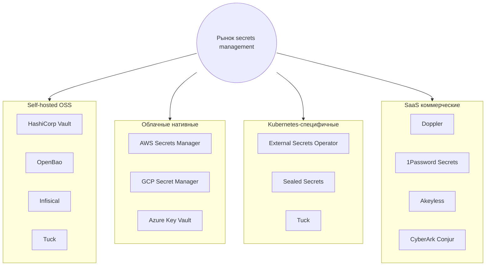
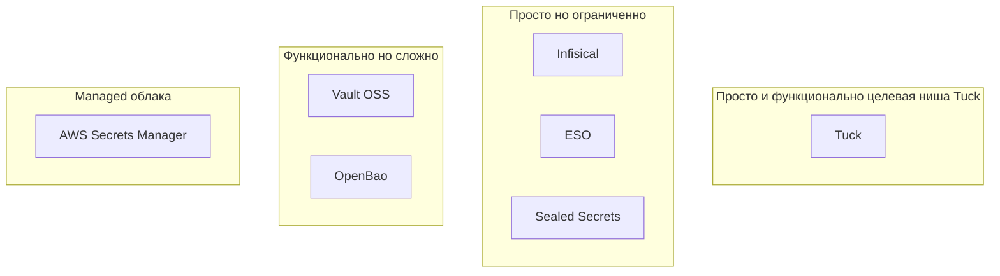
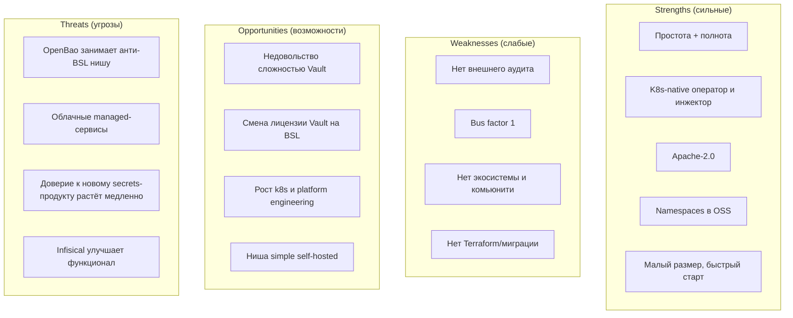

# 08 — Сравнительный анализ с конкурентами

[← Назад: Требования](07-requirements.md) · [К оглавлению](README.md) · [Далее: Рыночный анализ →](09-market-analysis.md)

> Раздел сравнивает Tuck с основными игроками рынка управления секретами. Оценки конкурентов отражают общеизвестное позиционирование продуктов и могут меняться с их развитием.

---

## 8.1. Ландшафт конкурентов

---

## 8.2. Ключевые конкуренты — краткая характеристика

| Продукт | Тип | Сильная сторона | Где тяжёл |
|---------|-----|-----------------|-----------|
| **HashiCorp Vault** | Self-hosted, отраслевой стандарт | Максимальная полнота, экосистема, доверие | Операционная сложность, BSL-лицензия, Enterprise-фичи платные |
| **OpenBao** | Форк Vault (Linux Foundation, MPL-2.0) | Открытая лицензия, совместимость с Vault | Наследует сложность Vault |
| **Infisical** | OSS + SaaS, developer-friendly | UX, простота для разработчиков | Требует БД (PostgreSQL), меньше «тяжёлой» крипто-функциональности |
| **AWS/GCP/Azure Secret Manager** | Облачные managed | Zero-ops, интеграция с облаком | Vendor lock-in, ограничены своим облаком, слабее по динамике/PKI |
| **External Secrets Operator (ESO)** | K8s-оператор | Синхронизация из внешних хранилищ | Не хранилище сам по себе, нужен бэкенд |
| **Sealed Secrets** | K8s-инструмент | Шифрование секретов в Git | Только шифрование манифестов, не полноценный менеджер |
| **Doppler / 1Password / Akeyless** | SaaS | UX, готовый сервис | Подписка, данные у вендора, лок-ин |
| **Tuck** | Self-hosted OSS, k8s-native | Простота эксплуатации + полнота функций + Apache-2.0 | Молодой, нет аудита/комьюнити |

---

## 8.3. Детальное сравнение: Tuck vs Vault vs OpenBao vs Infisical

| Критерий | Tuck | Vault (OSS) | OpenBao | Infisical |
|----------|:----:|:-----------:|:-------:|:---------:|
| Лицензия | **Apache-2.0** | BSL 1.1 | MPL-2.0 | MIT (+ SaaS) |
| Внешние зависимости | **нет (bbolt встроен)** | Consul/Raft | Consul/Raft | PostgreSQL + Redis |
| Размер бинаря | **~20 МБ** | ~300 МБ | ~300 МБ | контейнеры |
| Auto-unseal по умолчанию | **да** | нет (ручной/KMS) | нет | n/a |
| Seal-типы | dev/Shamir/Transit/AWS/GCP/Azure | Shamir/Transit/KMS | Shamir/Transit/KMS | n/a |
| KV v1/v2 | ✅/✅ | ✅/✅ | ✅/✅ | ✅ (свой) |
| Dynamic DB | ✅ | ✅ | ✅ | ограниченно |
| Dynamic AWS/GCP/Azure | ✅ | ✅ | ✅ | частично |
| PKI / Transit / SSH / TOTP | ✅/✅/✅/✅ | ✅/✅/✅/✅ | ✅/✅/✅/✅ | ⚠️ ограниченно |
| Auth: K8s/JWT/AppRole/LDAP/OIDC | ✅ | ✅ | ✅ | ✅(свои) |
| Identity (entity/group) | ✅ | ✅ | ✅ | ⚠️ |
| Namespaces / мультиарендность | **✅ (OSS)** | Enterprise | ⚠️ | ✅ (проекты) |
| HA | встроенный Raft | Raft/Consul | Raft/Consul | через БД |
| K8s-оператор (CRD) | **встроенный** | через ESO | через ESO | свой оператор |
| Webhook agent injector | **✅** | ✅ (Vault Agent) | ✅ | ⚠️ |
| Audit hash-chain | ✅ | ✅ | ✅ | ⚠️ |
| Web UI | ✅ (~85%) | ✅ | ✅ | ✅ (сильный) |
| Зрелость/доверие | молодой | **очень высокая** | высокая | растущая |
| Комьюнити | минимальное | **огромное** | заметное | заметное |
| Внешний аудит | ❌ | ✅ | ✅ (наследие) | частично |

Легенда: ✅ есть · ⚠️ частично/ограниченно · ❌ нет.

---

## 8.4. Позиционирование (карта «простота × полнота»)

**Вывод по позиционированию:** Tuck целится в правый верхний квадрант — «функционально как Vault, но просто как managed-сервис». Это незанятая ниша среди self-hosted OSS: Vault/OpenBao функциональны, но сложны; Infisical прост, но менее полон по «тяжёлой» крипто-функциональности; Sealed Secrets/ESO — узкоспециализированы.

---

## 8.5. Чем Tuck ЛУЧШЕ конкурентов

1. **Операционная простота при полноте функций.** Один бинарь ~20 МБ, ноль внешних зависимостей, auto-unseal по умолчанию — и при этом 8 движков, 6 auth, Identity, Namespaces. Vault/OpenBao требуют Consul/Raft и ручного unseal; Infisical — PostgreSQL+Redis.
2. **Kubernetes-native из коробки.** Встроенные оператор (CRD) и webhook-инжектор — не нужен отдельный ESO. Инжектор пишет секреты на tmpfs, **минуя etcd** (выше безопасность, чем у нативных K8s Secret).
3. **Бизнес-дружелюбная лицензия Apache-2.0.** В отличие от BSL у Vault — нет ограничений на коммерческое использование/конкуренцию.
4. **Namespaces/мультиарендность в open-source.** У Vault это платный Enterprise.
5. **Размер и скорость старта.** ~20 МБ и ~0.3 с старта против ~300 МБ у Vault.
6. **Шесть seal-бэкендов**, включая нативные AWS/GCP/Azure KMS с облачной identity — zero-ops auto-unseal.
7. **Чистая, обозримая кодовая база** (~22.6k строк, net/http без фреймворков) — легче аудировать и контрибьютить, чем огромный Vault.

---

## 8.6. Чем Tuck ХУЖЕ конкурентов

1. **Нет внешнего независимого аудита** крипто-ядра. У Vault/OpenBao многолетняя история аудитов и эксплуатации в проде. Для secrets-продукта это критично.
2. **Минимальное комьюнити и экосистема.** У Vault — тысячи интеграций, провайдеры Terraform/Ansible, плагины, обучение, найм специалистов. У Tuck — практически ничего.
3. **Bus factor = 1.** Один мейнтейнер против корпораций/фондов за конкурентами.
4. **Нет проверенной прод-эксплуатации в масштабе.** Нет публичных кейсов, SLA, историй инцидентов.
5. **Нет Terraform-провайдера и инструмента миграции с Vault** — высокий switching cost.
6. **CSI-драйвер не завершён** (у Vault есть зрелый CSI provider).
7. **Слабее managed-облаков по «zero-ops»** в чистом облачном сценарии: AWS/GCP/Azure Secret Manager не требуют вообще ничего хостить.
8. **UI менее зрелый**, чем у Infisical (которая сделала UX главным козырем).
9. **Совместимость с Vault — на уровне модели, а не API.** Существующие Vault-клиенты/провайдеры не работают «как есть».

---

## 8.7. SWOT-анализ

---

## 8.8. Вывод

Tuck предлагает **реальную и востребованную дифференциацию** — «Vault-уровень функций без Vault-уровня боли», с дружелюбной лицензией и k8s-native подходом. Это сильное ценностное предложение в незанятой нише.

Однако в категории «менеджер секретов» **доверие важнее фич**. Главные конкурентные пробелы — не функциональные, а репутационные: отсутствие независимого аудита, экосистемы и проверенной эксплуатации. Именно их закрытие (а не добавление новых движков) определит конкурентоспособность.

---

[← Назад: Требования](07-requirements.md) · [К оглавлению](README.md) · [Далее: Рыночный анализ →](09-market-analysis.md)
