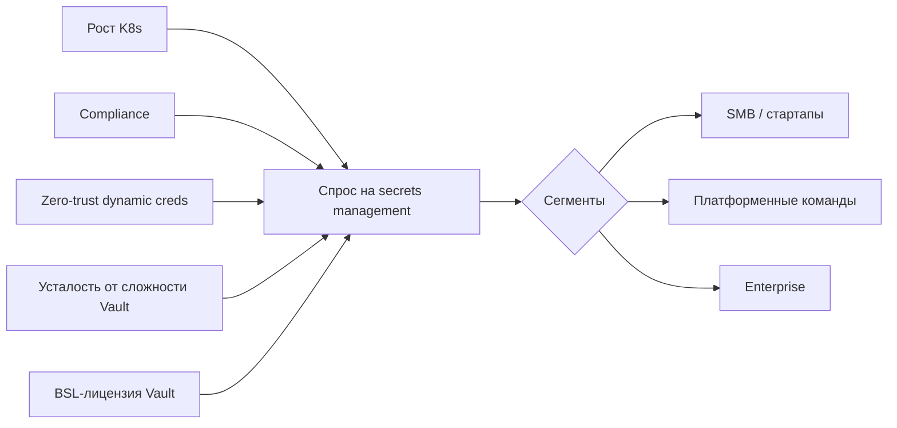
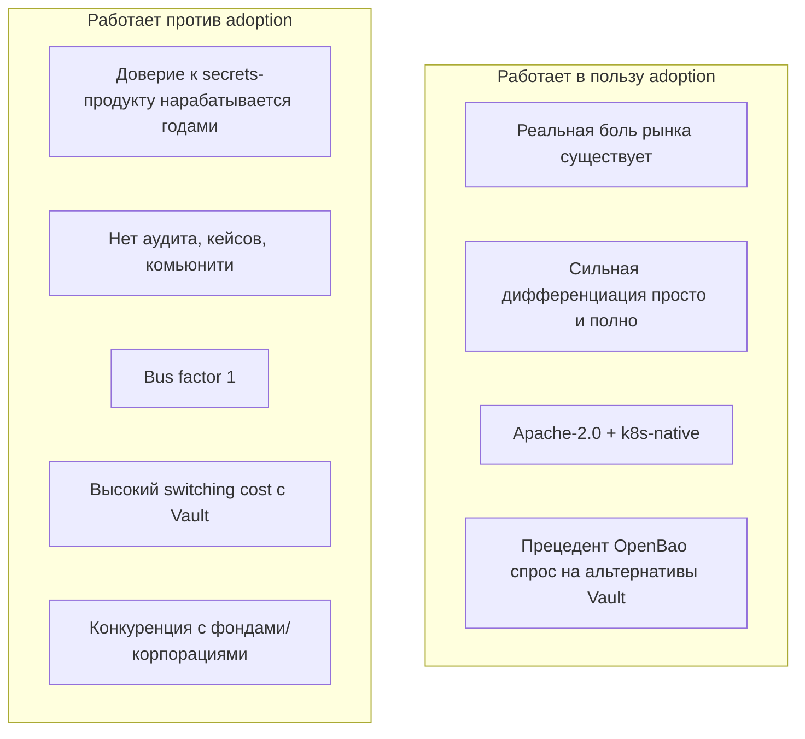
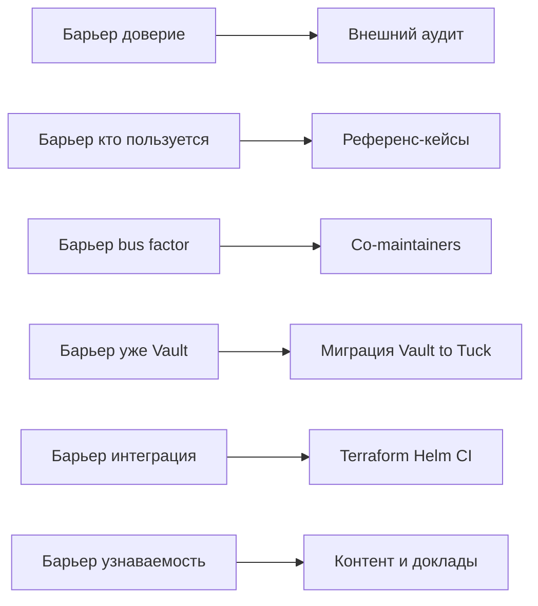
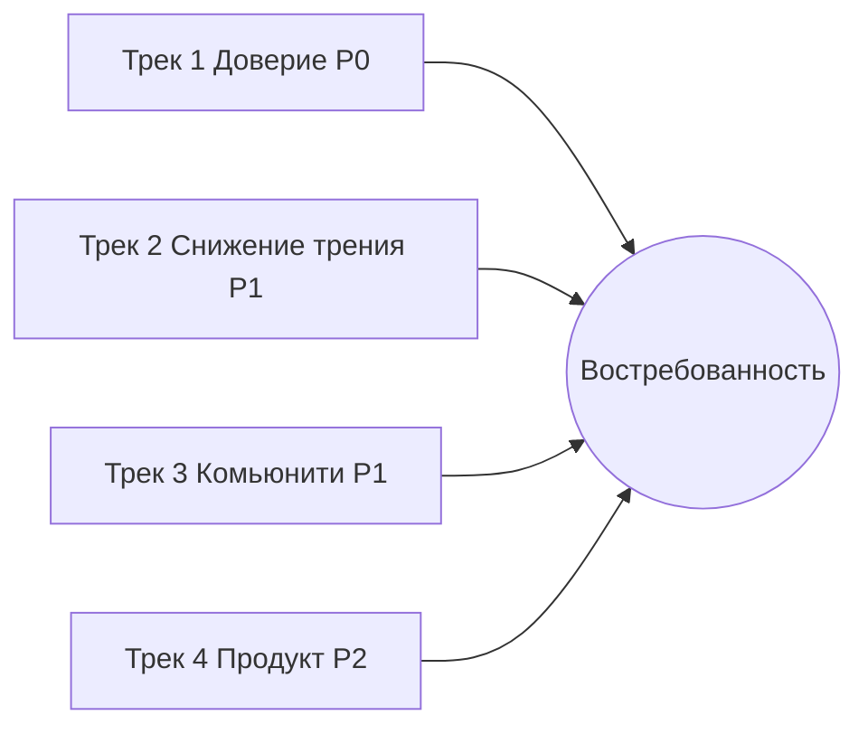
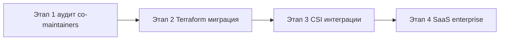

# 09 — Рыночный анализ и план востребованности

[← Назад: Конкуренты](08-competitive-analysis.md) · [К оглавлению](README.md)

> Раздел отвечает на вопросы: каков рынок, каковы шансы, что Tuck будут использовать, и что нужно сделать, чтобы он стал востребованным. Оценки — экспертные и стратегические, не финансовый прогноз.

---

## 9.1. Контекст рынка

Управление секретами — обязательный элемент инфраструктуры для любой компании с CI/CD, облаком и Kubernetes. Драйверы спроса:

- **Рост Kubernetes и platform engineering** — секреты нужно безопасно доставлять в поды.
- **Регуляторика и compliance** (PCI DSS, SOC2, ISO 27001, GDPR) — требуют шифрования, аудита, ротации.
- **Zero-trust и dynamic credentials** — отказ от долгоживущих статичных секретов.
- **Усталость от сложности Vault** и **смена его лицензии на BSL** — создали окно для альтернатив (что и породило OpenBao).

---

## 9.2. Целевые сегменты и их готовность к Tuck

| Сегмент | Боль | Подходит ли Tuck | Готовность к adoption |
|---------|------|:----------------:|:---------------------:|
| **Стартапы / SMB** | Vault слишком сложен и дорог в эксплуатации | ✅ Идеально | 🟢 Высокая |
| **Платформенные команды (mid-market)** | Нужна замена Vault без оверхеда | ✅ Хорошо | 🟡 Средняя (нужны кейсы) |
| **K8s-first компании** | Безопасная доставка секретов в поды | ✅ Идеально | 🟢 Высокая |
| **Enterprise / регулируемые** | Compliance, аудит, поддержка, SLA | ⚠️ Частично | 🔴 Низкая (нужен аудит, поддержка, доверие) |
| **Чистые облачные (single-cloud)** | Минимум хостинга | ❌ Лучше managed | 🔴 Низкая |

**Главная целевая ниша:** стартапы и платформенные команды на Kubernetes, которым Vault «велик», а managed-облака не подходят (мультиоблако, on-prem, контроль данных, стоимость).

---

## 9.3. Каковы шансы, что Tuck будут использовать?

### Честная оценка

**Вероятностная оценка (экспертная):**

| Сценарий | Что значит | Вероятность* |
|----------|------------|:------------:|
| **Нишевый успех** | Используется в десятках/сотнях небольших k8s-проектов, заметность в OSS | Умеренная–высокая (при активном развитии комьюнити) |
| **Заметный игрок** | Тысячи установок, упоминания в обзорах, интеграции | Низкая–умеренная (нужны аудит + комьюнити + маркетинг) |
| **Замена Vault в enterprise** | Промышленные внедрения с поддержкой/SLA | Низкая без коммерческой структуры/команды/аудита |
| **Останется hobby-проектом** | Технически отличный, но без пользователей | Реальный риск при пассивном продвижении |

\* Качественные оценки, не количественный прогноз.

**Главный вывод:** техническая база достаточна для adoption в нишевом сегменте. Решающий фактор — **не код, а доверие и сообщество**. Без целенаправленной работы над репутацией даже отличный продукт останется незамеченным.

---

## 9.4. Барьеры adoption и как их снимать

| Барьер | Действие | Приоритет |
|--------|----------|:---------:|
| Доверие к крипто | Независимый аудит + публикация отчёта | P0 |
| Социальное доказательство | 3–5 публичных design partners / кейсов | P0 |
| Bus factor | Привлечь co-maintainers, прозрачный governance | P0 |
| Switching cost с Vault | Миграционный инструмент (KV/policies/auth) | P1 |
| Интеграция в стек | Terraform-провайдер, GitHub Action, ArgoCD/Flux примеры | P1 |
| Узнаваемость | Блог, сравнения, доклады на k8s/DevOps-конференциях | P1 |
| Onboarding | «5 минут до первого секрета», интерактивный туториал, песочница | P1 |

---

## 9.5. Что нужно сделать, чтобы продукт стал востребованным

### Трек 1 — Доверие (фундамент)
- [ ] **Внешний security-аудит** крипто-ядра и auth с публичным отчётом.
- [ ] Прохождение/документирование готовности к **SOC2 / ISO 27001** контролям (для enterprise-разговоров).
- [ ] Прозрачный **security-процесс** (уже есть SECURITY.md) + bug bounty (хотя бы символический).
- [ ] **Расширение команды мейнтейнеров** и публичная governance-модель.

### Трек 2 — Снижение трения adoption
- [ ] **Миграция с Vault**: CLI, переносящий KV, политики, auth-роли.
- [ ] **Terraform-провайдер** `terraform-provider-tuck`.
- [ ] **Интеграции экосистемы**: ArgoCD/Flux, GitHub Actions, GitLab CI, Helm в Artifact Hub, оператор в OperatorHub.
- [ ] **Завершить CSI-драйвер**.
- [ ] **Песочница/демо** (web playground, `tuck demo`), интерактивный туториал.

### Трек 3 — Узнаваемость и комьюнити
- [ ] Серия статей: «Почему мы ушли с Vault на Tuck», бенчмарки, threat model в популярной форме.
- [ ] Доклады на профильных конференциях, гостевые посты.
- [ ] Прозрачный roadmap, регулярные релиз-ноты, активный issue-трекер.
- [ ] Discord/Slack-комьюнити, шаблоны для контрибьюторов (уже есть CONTRIBUTING.md).
- [ ] Сравнительные таблицы и «honest comparison» с конкурентами (без маркетингового вранья — это ценят в OSS).

### Трек 4 — Продуктовые улучшения (поддерживающие)
- [ ] Усиление **Web UI** до уровня UX Infisical.
- [ ] **Готовые рецепты**: интеграция с популярными БД, ingress, service mesh.
- [ ] **Шаблоны политик** и security-baseline «из коробки».
- [ ] Опциональный **управляемый/SaaS-вариант** (монетизация + zero-ops для тех, кто не хочет хостить).

---

## 9.6. Возможные модели монетизации (если есть такая цель)

| Модель | Описание | Применимость |
|--------|----------|:------------:|
| **Open-core** | Ядро Apache-2.0, платные enterprise-фичи (расширенный аудит, SSO-админка, поддержка) | 🟢 Высокая |
| **Managed / SaaS** | Хостинг Tuck как сервис, zero-ops для клиента | 🟢 Высокая |
| **Поддержка и SLA** | Платная техподдержка, консалтинг, обучение | 🟡 Средняя |
| **Marketplace-плагины** | Платные коннекторы/движки | 🟡 Средняя |
| **Чистый OSS** | Без монетизации, фокус на adoption/репутации | 🟢 (как стратегия роста) |

> Важно: агрессивная монетизация ядра подорвёт ключевое преимущество (Apache-2.0). Рекомендация — сначала adoption и доверие, монетизация — через managed/поддержку поверх свободного ядра.

---

## 9.7. Дорожная карта востребованности (12+ месяцев)

---

## 9.8. Итоговые выводы

1. **Рыночная потребность реальна**, а позиционирование Tuck («просто как managed, полно как Vault, свободно как Apache-2.0») попадает в незанятую нишу.
2. **Технически продукт готов** к нишевому adoption — функционал на уровне Vault OSS, чистая архитектура, зрелый релиз-процесс.
3. **Главное ограничение — доверие и экосистема, а не код.** В категории секретов это решающий фактор.
4. **Шансы на нишевый успех — умеренно-высокие** при условии активной работы над доверием (аудит), снижением трения (миграция, Terraform) и узнаваемостью (комьюнити, контент). При пассивном продвижении — высокий риск остаться невостребованным «техническим шедевром».
5. **Приоритет №1 — не новые фичи, а: внешний аудит + референс-кейсы + расширение команды.** Эти три пункта дают наибольший прирост вероятности adoption.

---

[← Назад: Конкуренты](08-competitive-analysis.md) · [К оглавлению](README.md)
