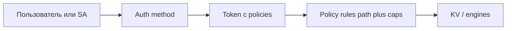

# 02 — Политики и scoped-токены

[← Все гайды](README.md)

## Цель

Выдать приложению токен, который может **только читать** секреты по заданному префиксу — не root.

## Кому подходит

Разработчик, DevOps, security-инженер.

## Предварительные условия

- Работающий Tuck ([01 — Первый секрет](01-pervyy-sekret.md))
- Root или admin-токен в `TUCK_TOKEN`

## Шаги

### 1. Создать секреты для демо

```powershell
.\tuckcli.exe kv put app/api-key "key-111"
.\tuckcli.exe kv put app/db-password "pass-222"
.\tuckcli.exe kv put admin/root-key "super-secret"
```

### 2. Создать политику (ACL)

Формат — массив `rules` с `path` и `capabilities`:

```powershell
$rules = '[{"path":"secret/app/*","capabilities":["read","list"]}]'
.\tuckcli.exe policy put app-readonly $rules
```

Проверка:

```powershell
.\tuckcli.exe policy get app-readonly
```

### 3. Выпустить scoped-токен

```powershell
.\tuckcli.exe token create --name=my-app --policy=app-readonly --ttl=24h
```

Сохраните `token` из ответа.

### 4. Проверить доступ scoped-токеном

```powershell
$env:TUCK_TOKEN = "tuck_..."   # новый scoped token
.\tuckcli.exe kv get app/api-key          # OK
.\tuckcli.exe kv get admin/root-key       # 403 — нет доступа
```

### 5. (Опционально) Token role для повторной выдачи

```powershell
.\tuckcli.exe token role create --name=app-reader --policy=app-readonly --ttl=1h --renewable
.\tuckcli.exe token create-role app-reader
```

## Проверка

| Действие | Ожидаемый результат |
|----------|---------------------|
| `policy get app-readonly` | rules с `secret/app/*` и `read`, `list` |
| `kv get app/api-key` (scoped) | успех |
| `kv get admin/root-key` (scoped) | `403 permission denied` |
| `token lookup-self` | policies содержит `app-readonly` |

## Модель доступа в Tuck



- **Deny-first**: если путь не разрешён явно — доступ запрещён.
- Пути в политиках указываются с mount: `secret/...`, `database/creds/...`, `pki/...`.

## Частые ошибки

| Симптом | Решение |
|---------|---------|
| 403 на разрешённый путь | Проверьте префикс: `secret/app/*`, не `app/*` |
| Политика не применилась | Токен создан до `policy put` — перевыпустите токен |
| `policy put` падает | JSON должен быть массивом `rules`, не объектом `paths` |

## Дальше

- K8s SA auth: [09 — Kubernetes SA auth](09-kubernetes-auth.md)
- AppRole для CI: [10 — AppRole](10-approle.md)
